# Introduction

## La statistique

L'ensemble des méthodes qui ont pour objet la collecte, le traitement et l'interprétation de données d'observation relatives à un groupe d'individus ou d'unités.

- Statistiques descriptives : décrire, résumer, visualiser des données.
- Statistiques inférentielles (inférence statistique) : induire des caractéristiques sur une population à partir d'un échantillon (relation, distribution).

## Population ou échantillon ?

- **Population** : ensemble des individus ou unités statistiques sur lesquels on veut faire des observations.
- **Echantillon** : sous-ensemble de la population, choisi de manière aléatoire ou non, qui permet de faire des observations.

Sélection de tous les bruns de la salle, population ou échantillon ?

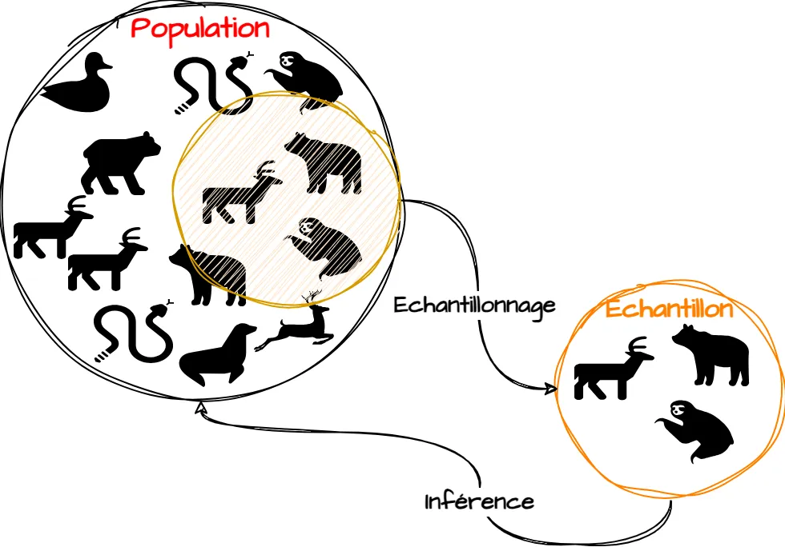{fig-align="center"}

## Le data mining

L'exploration et l'analyse de base de données pour le résumer, détecter des règles, des tendances, des associations ou des structures particulières. L'exploration des bases de données existantes en géosciences peut être utilisée pour détecter des nouvelles tendances ou comportements dans des milieux ou bien préparer une étude avant de une campagne de mesure.

## Objectifs du cours {.smaller}

- Apprendre à décrire un jeu de données, le synthétiser pour mettre en évidence les informations pertinentes qu'il contient et ses limites pour répondre à certaines questions.

- Pourvoir créer de nouvelles informations à partir de relations ou comportements identifiés dans les données. Utiliser ces informations pour prédire de nouvelles données et identifier communauté d'individus communs ou différents.

- Acquérir des outils de manipulation, description et d'analyse de données.

- Avoir une démarche critique sur les données, les outils statistiques utilisés et les résultats obtenus.

## R et RStudio

::: columns
::: {.column width="50%"}

- Un logiciel et language de développement très complet, gratuit et open source avec une communauté active. 
- Permet de reproduire et partager facilement les analyses. 
- Un début apprentissage un peu plus difficile que des logiciels "clé en main".
:::

::: {.column width="50%"}
{width="100%"} [^1]
:::
:::

[^1]: Artwork by @allison_horst.

## Ressources et sources du cours {.smaller}

- [Les statistiques pour statophobes (2004), Denis Poinsot](https://perso.univ-rennes1.fr/denis.poinsot/Statistiques_%20pour_statophobes/STATISTIQUES%20POUR%20STATOPHOBES.pdf){target="_blank"}
- Data Mining et Statistique décisionnelle (2017), Stéphane Tufféry, Editions Technip
- [Analyse-R, Joseph Larmarange - Université Paris Cité, IRD](https://larmarange.github.io/analyse-R/){target="_blank"}
- [Guide-R, Joseph Larmarange - Université Paris Cité, IRD](https://larmarange.github.io/guide-R/){target="_blank"}
- [Grimoire, Lise Vaudor, CNRS](http://perso.ens-lyon.fr/lise.vaudor/grimoireStat/_book/intro.html){target="_blank"}
- [Cours d'Eric Marcon, Agro Paris Tech](https://ericmarcon.github.io/Cours-R-Geeft/){target="_blank"}
- [Cours d'Antoine Massé, IUT de Bordeaux](https://sites.google.com/site/rgraphiques/home){target="_blank"}
- [R for datascience, Hadley Wickham, Mine Çetinkaya-Rundel, and Garrett Grolemund](https://r4ds.hadley.nz/){target="_blank"}
- [Formation ministérielle à R et aux sciences des données](https://mtes-mct.github.io/parcours-r/){target="_blank"}
- [Vidéos d'Eric Lombardot - Université Paris 1 Panthéon Sorbonne](https://www.youtube.com/@EricLombardot){target="_blank"}
- [Vidéos de Tierry Ancelle, EHESP, MCU-PH, Faculté de médecine Paris-Descartes](https://www.epiter.org/page/2366997-lecons-epiteriennes-en-ligne){target="_blank"}

Pour éviter R studio : 
- [Logiciel Jamovi](https://www.jamovi.org/){target="_blank"}
- [Logiciel Rattle](https://github.com/gjwgit/rattleng){target="_blank"}
  
## Plan du cours

- Introduction
- Statistiques univariées
- Statistiques bivariées
- La comparaison de jeux de données
- Statistiques multivariées ou  multimentionnelles
- Classification

## Données utilisées {.smaller}

\

- Données hydromorphologiques issus du [protocole CARHYCE](https://professionnels.ofb.fr/fr/node/386) (Agence Française de la Biodiversité). Des données retravaillées et valorisées sont disponibles sur [IED CARHYCE (CNRS-AFB)](https://analytics.huma-num.fr/ied_carhyce/){target="_blank"}[^2]
  - Mesures de morphologie du lit, de granulométrie, de débit et de ripisylve.
  - Des données enrichies par des estimations à plein bord et les surfaces des bassins versant.
  - Plus de 2000 stations de mesures.

[^2]: Gob F., Thommeret N., Bilodeau C., Tamisier V., Duval E., Legentil C., Grancher D., Raufaste S., Baudoin J-M. et Kreutzenberger K., Interface d’exploitation des données Carhyce [en ligne], Laboratoire de Géographie Physique – OFB [https://analytics.huma-num.fr/ied_carhyce/](https://analytics.huma-num.fr/ied_carhyce/) Consultée le 03/08/2024.

## Installation des (nombreux?) packages

```{r, echo=TRUE, collapse=FALSE, eval=FALSE}
# install all necessary packages
install.packages(c("ggplot2", "gridExtra", "dplyr", "tidyr", "tibble", 
                   "janitor", "skimr", "dataMaid", "plotly", 
                   "e1071", "gmodels", "ggpmisc", "nortest", 
                   "FactoMineR", "factoextra", "gtsummary", 
                   "explor", "boot", "qqplotr", "corrplot",
                   "readxl", "sf", "tmap"))
```


## Importons les pakages du cours

```{r, echo=TRUE, collapse=FALSE, results='hide'}
library(rlang) # for the sym function
library(ggplot2) # Graphics
library(gridExtra) # Multiple plots
library(tibble) # Table visualisation
library(janitor) # Column names cleaning
library(skimr) # Data summary
library(dataMaid) # Data report
library(plotly) # Interactive plots
library(e1071) # Skewness
library(gmodels) # Contingency tables
library(ggpmisc) # Regression line
library(nortest) # Normality tests
library(FactoMineR) # Factorial analysis
library(factoextra) # Factorial analysis
library(gtsummary) # Regression summary
library(explor) # Data exploration
library(boot) # Bootstrap
library(qqplotr) # QQ-plot
library(corrplot) # Correlation plot
library(readxl) # Excel files
library(sf) # Spatial data
library(tmap) # Thematic maps
library(dplyr) # Data manipulation
library(tidyr) # Data cleaning
```

## Explorons le jeu de données

```{r, echo=TRUE, collapse=FALSE, results='hide'}
# import dataset
carhyce_brute <- read.csv("data/Operations_CARHYCE_2024-06-25.csv",
                  sep=";",dec=",",header=TRUE, encoding = "utf-8")
```

```{r, echo=TRUE, collapse=FALSE}
print(as_tibble(head(carhyce_brute)))
```


## Dimensions et variables

```{r, echo=TRUE, collapse=FALSE, eval=FALSE}
names(carhyce_brute) # variable names
class(carhyce_brute) # table type (data.frame)
dim(carhyce_brute)   # table dimension
str(carhyce_brute)   # variable type
```

```{r, echo=TRUE, collapse=FALSE}
print(str(carhyce_brute))
```

## Les données quantitatives

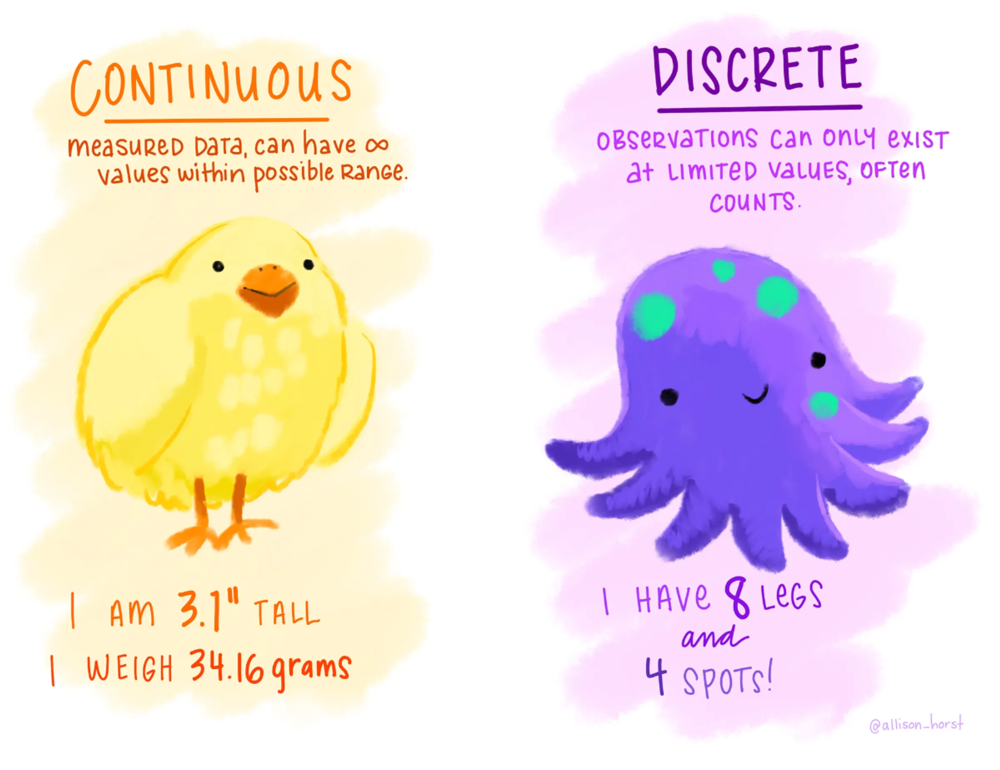{width="60%" fig-align="center"} [^3]

[^3]: Artwork by @allison_horst.

## Les données qualitatives

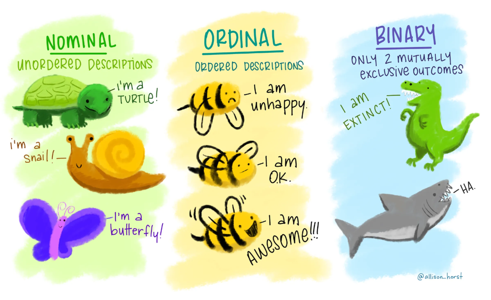{width="80%" fig-align="center"} [^4]

[^4]: Artwork by @allison_horst.

## Nettoyage des colonnes

```{r, echo=TRUE, collapse=FALSE}
# clean column names with janitor
carhyce <- carhyce_brute %>% # %>% = pipe operator from dplyr |> for native pipe
  clean_names() # clean column  names
print(names(carhyce))
```

# Statistiques univariées

## Objectifs

- Description des types de variables
- Analyse de la distribution (graphiques et paramètres)
- Discrétisation de variables quantitatives
- Détection et traitement des valeurs extrêmes
- Comparaison à la loi normale

## nettoyage des lignes et sélection des variables

```{r, echo=TRUE, collapse=FALSE}
carhyce_stat <- carhyce %>% 
  group_by(code_station) %>% # group by station
  filter(date_realisation == max(date_realisation)) %>% # select the last date
  ungroup() %>%  # ungroup data
  select(surface_bv_km2, continuite_ripisylve_rive_gauche,
         continuite_ripisylve_rive_droite, classe_ripisylve,
         nom_her_ou_dom_dominant, debit_plein_bord_m3_s,
         largeur_mouillee_qb_m) # select columns
print(head(carhyce_stat))
```

## Synthèse analyses univariées

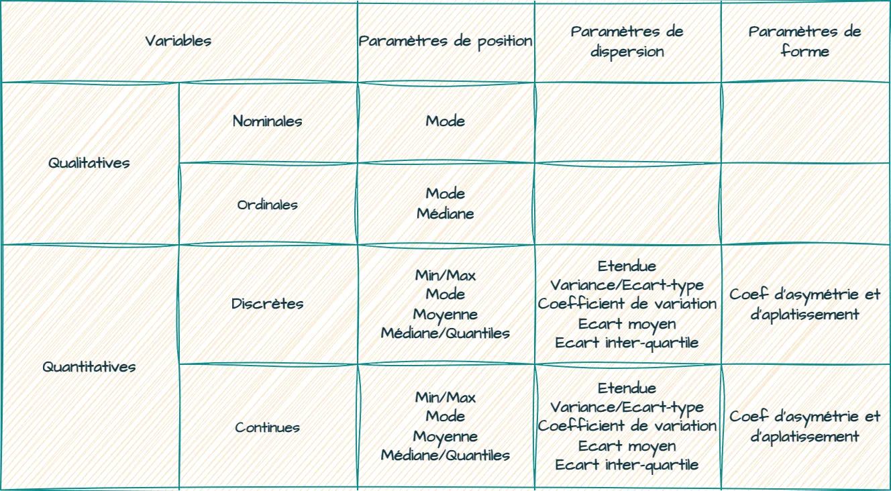{width="100%" fig-align="center"}

## Paramètres de position et de dispersion

Calcul rapide de paramètres pour les surfaces de bassins versants des stations CARHYCE.

```{r, echo=TRUE, collapse=FALSE}
summary(carhyce_stat$surface_bv_km2)
```
<details>
<summary>Interprétation</summary>
  [La moyenne est près de 5 fois plus élevé que la médiane, elle est même bien plus élevée que le 3ème quartile. La distribution est donc asymétrique à droite. Nous avons probablement des valeurs extrêmes qui rendent cette moyenne particulièrement élevée. Le mininum est de 0, on ne peut pas avoir de surface de bassin versant nulle, il y a probablement des erreurs. De même le maximum est supérieur à 70 000 km2, le protocole CARHYCE est surtout réalisé sur des petits cours d'eau et à pied, ce maximum représente plus du double du bassin versant de la Loire.]{style="font-size: 0.7em;"}
</details>

## Histogramme

[Représentation des effectifs ou fréquences d'une variable quantitative divisée en classes.]{style="font-size: 0.7em;"}

::: columns
::: {.column width="70%"}

```{r, echo=TRUE, collapse=FALSE, fig.align='center'}
# Histogram
hist(carhyce_stat$surface_bv_km2, 
     main = "Surfaces de bassins versants", 
     xlab = "Surface de bassins versants (km2)", col = "lightblue")
```
:::
::: {.column width="30%"}


<details>
<summary>Interprétation</summary>
  [La distribution est très dissymétrique à droite. Cet histogramme ne permet pas de bien représenter la distribution à cause des valeurs extrêmes.]{style="font-size: 0.7em;"}
</details>

:::
:::

## Niveau de dissymétrie

\

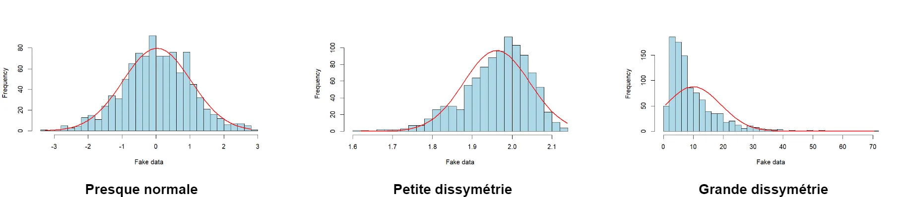{width="100%" fig-align="center"}

```{r, echo=FALSE, eval=FALSE}
# draw an histogram close to a normal distribution with fake data with the normal curve on top
# set.seed(123)  # For reproducibility
fake_data <- rnorm(1000, mean = 0, sd = 1)  # Generate 1000 samples
h <- hist(fake_data, col = "lightblue", main = "", xlab = "Fake data", breaks = 30)
xfit <- seq(min(fake_data), max(fake_data), length = 40)
yfit <- dnorm(xfit, mean = mean(fake_data), sd = sd(fake_data))
yfit <- yfit * diff(h$mids[1:2]) * length(fake_data)
lines(xfit, yfit, col = "red", lwd = 2)
```

```{r, echo=FALSE, eval=FALSE}
# draw an histogram close to a normal distribution with fake data with the normal curve on top
# set.seed(123)  # For reproducibility
fake_data <- rweibull(1000, shape = 30, scale = 2)  # Generate 1000 samples
h <- hist(fake_data, col = "lightblue", main = "", xlab = "Fake data", breaks = 30)
xfit <- seq(min(fake_data), max(fake_data), length = 40)
yfit <- dnorm(xfit, mean = mean(fake_data), sd = sd(fake_data))
yfit <- yfit * diff(h$mids[1:2]) * length(fake_data)
lines(xfit, yfit, col = "red", lwd = 2)
```

```{r, echo=FALSE, eval=FALSE}
# draw an histogram close to a normal distribution with fake data with the normal curve on top
# set.seed(123)  # For reproducibility
fake_data <- data_lognormal <- rlnorm(1000, meanlog = 2, sdlog = 0.8)
h <- hist(fake_data, col = "lightblue", main = "", xlab = "Fake data", breaks = 30)
xfit <- seq(min(fake_data), max(fake_data), length = 40)
yfit <- dnorm(xfit, mean = mean(fake_data), sd = sd(fake_data))
yfit <- yfit * diff(h$mids[1:2]) * length(fake_data)
lines(xfit, yfit, col = "red", lwd = 2)
```


## Boxplot / boîte à moustache

::: columns
::: {.column width="60%"}

```{r, echo=TRUE, collapse=FALSE}
# Boxplot
boxplot(carhyce_stat$surface_bv_km2, 
        main = "Surfaces de bassins versants", 
        ylab = "Surface de bassins versants (km2)", col = "lightblue")
points(1,mean(carhyce_stat$surface_bv_km2,na.rm=T),pch=16,col="red")
```
:::
::: {.column width="40%"}
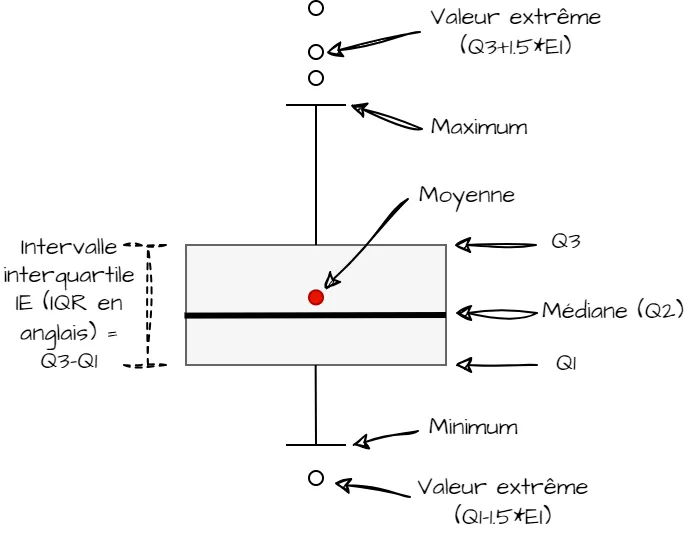{width="100%" fig-align="center"}
:::
:::

## Discrétiser une variable quantitative {.smaller}

- **Règle de Sturges** : méthode de détermination du nombre de classes à utiliser dans un histogramme => avoir un nombre de classes qui soit à la fois suffisamment grand pour capturer la structure de la distribution des données, mais pas trop grand pour ne pas perdre de sensibilité dans la visualisation.

- En pratique, il est souvent recommandé de tester plusieurs nombres de classes et de choisir celui qui offre la meilleure représentation visuelle des données tout en préservant leur structure.

- Autres méthodes : 
    - Effectifs égaux : par exemple les quantiles
    - Intervalles égaux : par exemple une classe toute les X unités
    - Par seuil de valeurs : par exemple les classes de granulométrie

## Discrétisation "manuelle"

Par la règle de Sturges
```{r, echo=TRUE, collapse=FALSE, eval=FALSE}
bins <- nclass.Sturges(carhyce_stat$surface_bv_km2) # set breaks with Sturges
carhyce_stat$surface_bv_km2_sturges <- cut(carhyce_stat$surface_bv_km2, 
                                           breaks = bins, 
                                           include.lowest = TRUE, 
                                           right = FALSE) # new column with breaks
```

Par seuil de valeurs
```{r, echo=TRUE, collapse=FALSE, eval=FALSE}
carhyce_stat$surface_bv_km2_breaks <- cut(carhyce_stat$surface_bv_km2, 
                                          breaks = c(0, 50, 100, 500, Inf), 
                                          labels = c("petit", "moyenne", "grand", "très grand"))
```


## Changement de discrétisation et outliers

```{r, echo=TRUE, collapse=FALSE, warning=FALSE, fig.height=5, fig.align='center'}
# plotly interactive histogram with 1000 breaks
plot_ly(x = carhyce_stat$surface_bv_km2, type = "histogram", nbinsx = 1000)
```

## Les outliers ou valeurs extrêmes

- Valeurs extrêmes qui ne suivent pas la distribution générale des données.
- Peuvent être des erreurs de mesure, des valeurs aberrantes ou des valeurs extrêmes.
- Peuvent fausser les résultats des analyses statistiques qui ne seront plus représentatives de la population.
- Rend la lecture et l'interprétation des graphiques difficiles.

=> Nécessite une vraie réflexion sur leur origine et leur pertinence dans la suite des analyses statistiques.

## Retrait des valeurs extrêmes

```{r, echo=TRUE, collapse=FALSE}
# keep the data below the 90th percentile and above 0
carhyce_stat <- carhyce_stat %>% 
  filter(surface_bv_km2 < quantile(carhyce_stat$surface_bv_km2, 0.90, na.rm = TRUE)) %>% 
  filter(surface_bv_km2 > 0)
```

::: columns
::: {.column width="50%"}
```{r, echo=TRUE, collapse=FALSE}
# Histogram with normal curve
h <- hist(carhyce_stat$surface_bv_km2, col = "lightblue", 
          main = "Surface des bassins versants", 
          xlab = "Surface de bassins versants (km2)") 
xfit <- seq(min(carhyce_stat$surface_bv_km2),
            max(carhyce_stat$surface_bv_km2), length = 40) 
yfit <- dnorm(xfit, mean = mean(carhyce_stat$surface_bv_km2), sd = sd(carhyce_stat$surface_bv_km2)) 
yfit <- yfit * diff(h$mids[1:2]) * length(carhyce_stat$surface_bv_km2) 
lines(xfit, yfit, col = "red", lwd = 2)
```
:::

::: {.column width="50%"}
```{r, echo=TRUE, collapse=FALSE}
# Boxplot
boxplot(carhyce_stat$surface_bv_km2, 
        main = "Surfaces de bassins versants", 
        ylab = "Surface de bassins versants (km2)", 
        col = "lightblue", range = 0)
points(1,mean(carhyce_stat$surface_bv_km2,na.rm=T),pch=16,col="red")
```
:::
:::

## Loi normale ou loi de Gauss {.smaller}

-  Distribution symétrique centrée sur la moyenne dont la forme est déterminée par l'écart-type.

Définie par une fonction de probabilité :

- Environ 68% des valeurs sont comprises entre $\mu - \sigma$ et $\mu + \sigma$.
- 95% des valeurs sont comprises entre $\mu - 1.96\sigma$ et $\mu + 1.96\sigma$.

- Très utilisées dans les tests statistiques ou la description de phénomènes aléatoires.

```{r, echo=FALSE, collapse=FALSE, fig.align='center'}
# several density plots on the same graph with dnorm
x <- seq(-4, 4, length=100)
hx <- dnorm(x, mean=0, sd=1)
hx2 <- dnorm(x, mean=-0.5, sd=0.7)
hx3 <- dnorm(x, mean=0.5, sd=0.5)
plot(x, hx, type="l", lwd=2, col="black", xlab="x", ylab="Density", main="Density de distributions normale", ylim=c(0,0.8), xlim=c(-5,5))
lines(x, hx2, lwd=2, col="red")
lines(x, hx3, lwd=2, col="blue")
```

## Coefficient d'asymétrie de Fisher

```{r, echo=TRUE, collapse=FALSE}
# skewness
e1071::skewness(carhyce_stat$surface_bv_km2, na.rm = TRUE, type = 1) # type 1 = Fisher
```

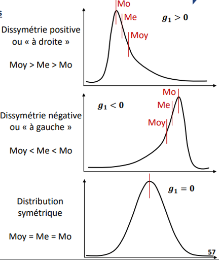{width="100%" fig-align="center"}

## Coefficient d'aplatissement de Fisher

```{r, echo=TRUE, collapse=FALSE}
# kurtosis
e1071::kurtosis(carhyce_stat$surface_bv_km2, na.rm = TRUE, type = 1) # type 1 = Fisher
```

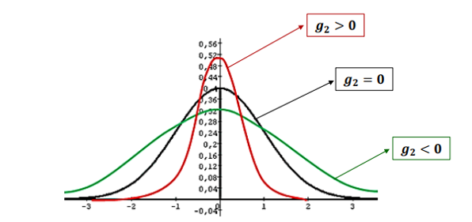{width="100%" fig-align="center"}

## QQ-plot ou diagramme quantile-quantile {.smaller}

On compare les valeurs des quantiles de la distribution observée (ordonnées) aux valeurs des quantiles pour une loi normale de moyenne et d'écart-type de la distribution (abscisse).

```{r, echo=FALSE}
set.seed(123)  # Pour la reproductibilité
n <- 1000      # Taille des échantillons

# 1. Distribution normale
normal <- rnorm(n, mean = 0, sd = 1)
# 2. Distribution dissymétrique à gauche (skewed left)
skew_left <- rbeta(n, 9, 2)  # Beta avec alpha > beta -> skew left
# 3. Distribution dissymétrique à droite (skewed right)
skew_right <- rbeta(n, 2, 9) # Beta avec alpha < beta -> skew right
# 4. Distribution à queue légère (light-tailed)
light_tail <- runif(n, min = -3, max = 3)  # Uniforme, peu de valeurs extrêmes
# 5. Distribution à queue lourde (heavy-tailed)
heavy_tail <- rt(n, df = 3)  # Student t avec faible df -> queues lourdes
# 6. Distribution bimodale
bimodal <- c(rnorm(n/2, -2, 0.5), rnorm(n/2, 2, 0.5))

# Fonction pour tracer histogramme + QQ-plot avec courbe normale
plot_dist <- function(x, title){
  mu <- mean(x)
  sigma <- sd(x)
  
  # Histogramme avec courbe normale
  p1 <- ggplot(data = data.frame(x=x), mapping = aes(x=x)) +
    geom_histogram(aes(y=..density..), bins=30, fill="skyblue", color="black") +
    stat_function(fun=dnorm, args=list(mean=mu, sd=sigma), color="red", size=1) +
    ggtitle(paste(title, "- Histogramme")) +
    theme_minimal()
  
  # QQ-plot
  p2 <- ggplot(data.frame(x=x), aes(sample=x)) +
    stat_qq_band() + stat_qq_line(color="red") +
    stat_qq_point()+
    ggtitle(paste(title, "- QQ-plot")) +
    theme_minimal()
  
  grid.arrange(p1, p2, ncol=2)
}
```


::: panel-tabset
### Normale

```{r, echo=TRUE, collapse=FALSE}
plot_dist(normal, "Normale")
```


### Diss. gauche

```{r, echo=TRUE, collapse=FALSE}
plot_dist(skew_left, "Dissymétrie à Gauche")
```

### Diss. droite

```{r, echo=TRUE, collapse=FALSE}
plot_dist(skew_right, "Dissymétrie à Droite")
```

### Homogène

```{r, echo=TRUE, collapse=FALSE}
plot_dist(light_tail, "Homogène (light tailed)")
```

### Concentrée

```{r, echo=TRUE, collapse=FALSE}
plot_dist(heavy_tail, "Concentrée (heavy tailed)")
```

### Bimodale

```{r, echo=TRUE, collapse=FALSE}
plot_dist(bimodal, "Bimodale")
```
:::


## QQ-plot - exemple

```{r, echo=TRUE, collapse=FALSE}
# QQ-plot
ggplot(data = carhyce_stat, mapping = aes(sample = surface_bv_km2)) +
  stat_qq_band() +
  stat_qq_line() +
  stat_qq_point() +
  labs(title = "QQ-plot de la surface des bassins versants", x = "Quantiles théoriques", y = "Quantiles observés")
```


## Tests statistiques ? - Principe {.smaller}

- Je lance une pièce de monaie 5 fois et elle tombe 5 fois sur pile => 🤔 la pièce doit être truquée.... A partir de combien de pile à la suite je peux considérer que la pièce est truquée?

- **Partons d'une hypothèse : La pièce est bien équilibrée** (ou j'ai 50% de chance d'avoir pile ou face).

Je vais donc calculer la probabilité d'obtenir 5 fois pile si la pièce est équilibrée (ou dans les conditions de l'hypothèse). Je considère que si la probabilité d'obtenir 5 fois pile est inférieure à 5%, je peux rejeter l'hypothèse que la pièce est équilibrée.

\

La loi binomiale permet de calculer ces probabilités. J'ai 3% de chance d'obtenir 5 fois pile si la pièce est équilibrée. Je peux donc rejeter l'hypothèse que la pièce est équilibrée tout en sachant que j'ai 5% de chance de me tromper. 5% est donc le risque (arbitraire) que j'ai décidé à priori, que la pièce soit équilibrée alors que j'affirme que la pièce est truquée.

```{r, include=FALSE}
# densité de probabilité de la loi binomiale
n <- 5  # Nombre de lancers
p <- 0.5  # Probabilité de succès (pile)
# Valeurs possibles de succès
x <- 0:n
# Densité de probabilité
prob <- dbinom(x, size = n, prob = p)
# Représentation graphique
plot(x, prob, type = "h", lwd = 2, col = "blue",
     xlab = "Nombre de succès", ylab = "Probabilité", ylim = c(0, 0.5),
     main = "Densité de probabilité de la loi binomiale")
# ajouter les valeurs
text(x, prob, labels = round(prob, 2)*100, pos = 3)
```

## Tests statistiques ? - test d'adéquation {.smaller}

Partons d'une hypothèse :

- $H_0$ : la distribution suit une loi normale.
- $H_1$ : la distribution ne suit pas une loi normale.

**Quel est la probabilité d'obtenir notre distribution observée si la distribution était normale?**

On compare notre distribution observée à une distribution théorique (ici la loi normale). Si notre distribution observée à très peu de chance d'être obtenue si la distribution était normale, on peut rejeter $H_0$. Si nos observations appartiennent aux résultats qui ont une chance d'être obtenus si $H_0$ est vraie, on peut accepter $H_0$ (ou $H_0$ reste crédible).

\

Le "très peu de chance" est représenté par le risque $\alpha$ (seuil de significativité ou risque de premier espèce), souvent de 5%. Si la probabilité d'obtenir notre distribution observée est inférieure à 5% si la distribution était normale, on peut rejeter $H_0$. 
On peut choisir un risque $\alpha$ plus faible selon notre confiance dans nos résultats et l'enjeu du risque. Imaginez que l'on teste l'efficacité d'un médicament d'une maladie grave... as t'on envie d'avoir 1 chance sur 20 de se tromper?

## Tests statistiques ? - p-value {.smaller}

- Tous les tests se concluent par une p-value. On la compare au seuil de significativité $\alpha$ annoncée avant le test.

- Interprétation de la p-value : $p=0.15$ signifie que l'on a 15% de chance d'obtenir les données observées si $H_0$ est vraie (ou si la distribution était normale). $p$ n'est pas un risque de se tromper mais une mesure de la significativité du résultat (ou une probabilité à postériori). Le risque de se tromper se choisi à priori et non à postériori du test.

- p-value < $\alpha$ : on rejette $H_0$ et on accepte $H_1$ avec le riques de se tromper de $\alpha$. La différence observée est significative.
- p-value > $\alpha$ : on accepte $H_0$ **mais** on ne peut pas dire que $H_0$ est vraie 🤯. 

*Petite subtilité, le fait d'accepter $H_0$ ne signifie pas que $H_0$ soit vraie, mais que sur la base des données observées rien ne permet de conclure qu'elle soit fausses.*

## Tests statistiques ? - erreur! {.smaller}

Lors d'un test statistique, on peut faire deux types d'erreurs :

- **Erreur de type I** : Risque de rejeter $H_0$ alors qu'elle est vraie. Risque $\alpha$ => on affirme une différence alors qu'en réalité il n'y en a pas.
- **Erreur de type II** : Risque de ne pas rejeter $H_0$ alors qu'elle est fausse. Risque $\beta$ => on accepte qu'il n'y a pas de différence alors qu'en réalité il y en a une. On se sait pas calculer ce risque, on ne peut donc pas affirmer $H_0$.

Le risque $\beta$ est d'autant plus petit que l'échantillon est important. La puissance d'un test, $1 - \beta$, est la probabilité de rejeter $H_0$ alors qu'elle est fausse. Pour détecter une faible différence, il faut un test puissant, soit un échantillon suffisamment grand (voir la vidéo de [Tierry Ancelle](https://www.youtube.com/watch?v=qWxJkq7QFWY){target="_blank"} pour une très bonne illustration).

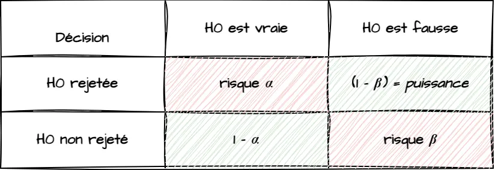{width="100%" fig-align="center"}

## Tests statistiques ? - ressources

Des vidéos très pédagogiques de [Tierry Ancelle](https://www.epiter.org/page/2366997-lecons-epiteriennes-en-ligne){target="_blank"} : 

- [Principes des tests statistiques](https://www.youtube.com/watch?v=qWxJkq7QFWY){target="_blank"}
- [Le petit p](https://www.youtube.com/watch?v=X6gPReE1w2g){target="_blank"}

Sur la description, l'histoire et l'utilisation des tests statistiques : 

- L'ouvrage en ligne de Denis Poinsot ["Les statistiques pour les statophobes" (2004)](https://perso.univ-rennes1.fr/denis.poinsot/Statistiques_%20pour_statophobes/STATISTIQUES%20POUR%20STATOPHOBES.pdf){target="_blank"}

## Test de normalité - précaution / utilisation

- Les tests de normalité sont sensibles à la taille de l'échantillon : 
    - Pour un échantillon de taille réduite, les tests de normalité peuvent être biaisés.
    - Pour un échantillon de taille importante, les tests de normalité peuvent être trop sensibles.

- Souvent utilisé au prélable d'autres tests statistiques dit paramétriques : 
  - Shapiro-Wilk => meilleur pour de petits échantillons (<2000)
  - Kolmogorov-Smirnov => grands échantillons (>2000)
  - Anderson-Darling => grands échantillons (>2000)

## Test de normalité

::: panel-tabset

### Shapiro-Wilk
```{r, echo=TRUE, collapse=FALSE}
shapiro.test(carhyce_stat$surface_bv_km2)
```

### Anderson-Darling
```{r, echo=TRUE, collapse=FALSE}
ad.test(carhyce_stat$surface_bv_km2)
```

### Kolmogorov-Smirnov
```{r, echo=TRUE, collapse=FALSE}
ks.test(carhyce_stat$surface_bv_km2, "pnorm", mean = mean(carhyce_stat$surface_bv_km2), sd = sd(carhyce_stat$surface_bv_km2))
```
:::

- $H_0$ : la variable suit une distribution normale.
- $H_1$ : la variable ne suit pas une distribution normale.

- p-value = 2.2e-16 < 0.05, on peut rejeter $H_0$ et valider $H_1$ avec une probabilité de se tromper de 5%.

## Distribution des classes  de ripisylve - Carhyce

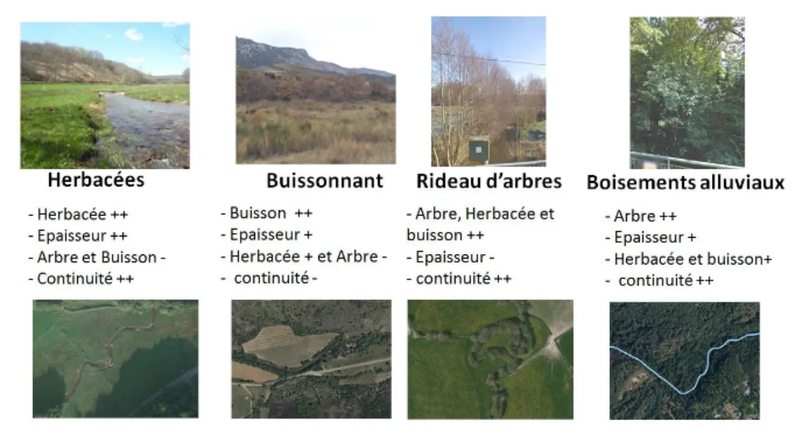{width="70%" fig-align="center"}[^5]

[^5]: [Gob F., Thommeret N., Bilodeau C., Tamisier V., Duval E., Legentil C., Grancher D., Raufaste S., Baudoin J-M. et Kreutzenberger K., Interface d’exploitation des données Carhyce [en ligne], Laboratoire de Géographie Physique – OFB [https://analytics.huma-num.fr/ied_carhyce/](https://analytics.huma-num.fr/ied_carhyce/) Consultée le 03/08/2024.]{style="font-size:0.7em;"}

## Distribution des classes de ripisylve

```{r, echo=TRUE, collapse=FALSE}
# Table
print(table(carhyce_stat$classe_ripisylve))
```

```{r, echo=TRUE, collapse=FALSE}
# Create a frequency table
freq_table <- carhyce_stat %>%
  group_by(classe_ripisylve) %>%
  summarise(count = n()) %>%
  mutate(freq_percent = count / sum(count) * 100,
         cum_freq = cumsum(count),
         cum_freq_percent = cumsum(freq_percent))
print(freq_table)
```

## Diagramme en secteur

```{r, echo=TRUE, collapse=FALSE}
# Pie chart
pie(table(carhyce_stat$classe_ripisylve), main = "Répartition des classes de ripisylve")
```

## Cheat code exploration de données

```{r, echo=TRUE, collapse=FALSE}
print(skim(carhyce_stat$surface_bv_km2))
```

```{r, echo=TRUE, collapse=FALSE, results='hide'}
# makeDataReport(carhyce_stat)
```

# Statistiques bivariées

## Objectifs

- Pouvoir décrire la relation qui peut exister entre deux variables.
- Utiliser les bons outils selon la nature des variables à comparer.
- Evaluer le type, l'intensité et le sens d'une relation entre deux variables quantitatives.

## Un peu de vocabulaire

- La **relation** de **dépendance** vs **indépendance** : deux variables sont dépendantes si les variations de l'une influence les variations de l'autre ou que les deux variables varient symétriquement.
- Deux variables dépendantes : 
  - Variables qualitatives => **association**
  - Variables quantitative => **corrélation** => **forme** (linaire, exponentielle...), **sens** (+ ou -), **intensité** 

## Reprenons nos données

```{r, echo=TRUE, collapse=FALSE}
carhyce_stat <- carhyce %>% 
  # select the last date for each station
  group_by(code_station) %>% # group by station
  filter(date_realisation == max(date_realisation)) %>% # select the last date by group
  ungroup() %>%  # ungroup data
  filter(surface_bv_km2 < quantile(carhyce$surface_bv_km2, 0.90, na.rm = TRUE)) %>% # keep surface_bv_km2 data below the 90th percentile
  filter(debit_plein_bord_m3_s < quantile(carhyce$debit_plein_bord_m3_s, 0.95, na.rm = TRUE)) %>%
  filter(largeur_mouillee_qb_m < quantile(carhyce$largeur_mouillee_qb_m, 0.975, na.rm = TRUE)) %>%
  filter(vitesse_moyenne_qb_m_s < quantile(carhyce$vitesse_moyenne_qb_m_s, 0.975, na.rm = TRUE)) %>%
  filter(d50_mm < quantile(carhyce$d50_mm, 0.99, na.rm = TRUE)) %>%
  # group categories continuite_ripisylve_rive_gauche and continuite_ripisylve_rive_droite :"espacée" = "bosquets éparses" + "espacée-régulière" + "isolée"
  mutate(continuite_ripisylve_rive_gauche = ifelse(continuite_ripisylve_rive_gauche %in% c("bosquets éparses", "espacée-régulière", "isolée"), "espacée", continuite_ripisylve_rive_gauche),
         continuite_ripisylve_rive_droite = ifelse(continuite_ripisylve_rive_droite %in% c("bosquets éparses", "espacée-régulière", "isolée"), "espacée", continuite_ripisylve_rive_droite)) %>%
  # select columns
  select(surface_bv_km2, 
         continuite_ripisylve_rive_gauche,
         continuite_ripisylve_rive_droite,
         debit_plein_bord_m3_s,
         largeur_mouillee_qb_m,
         vitesse_moyenne_qb_m_s,
         d50_mm,
         nombre_transect) # select columns
```

## Qualitatif VS qualitatif - Tableau de contingence

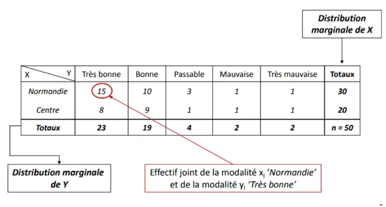{width="100%" fig-align="center"}

[Distribution jointe de deux variables qualitatives (ou quantitatives discrétisées)]{style="font-size: 0.7em;"}

[On compte les individus pour chaque modalité des deux variables]{style="font-size: 0.7em;"}

[Distribution conditionnelle : ]{style="font-size: 0.7em;"}

[   - en ligne : quelle distribution de X des cours d'eau normand]{style="font-size: 0.7em;"}

[   - en colonne : quelle distribution de Y des cours d'eau de bonne qualité]{style="font-size: 0.7em;"}

## Tableau de contingence

::: panel-tabset
### Rbase

```{r, echo=TRUE, collapse=FALSE}
# Rbase method contingency table
tab <- table(carhyce_stat$continuite_ripisylve_rive_gauche, carhyce_stat$continuite_ripisylve_rive_droite,
             dnn = c("Ripisylve RG", "Ripisylve RD"))
tab_mag <- addmargins(tab) # margins (effectifs marginaux)
print(tab_mag)
```

### gmodels effectifs

```{r, echo=TRUE, collapse=FALSE, results='hide'}
contingency_table <- CrossTable(carhyce_stat$continuite_ripisylve_rive_gauche, 
                                carhyce_stat$continuite_ripisylve_rive_droite,
                                dnn = c("Ripisylve RG", "Ripisylve RD"),
                                prop.chisq = FALSE, prop.t = TRUE, prop.r = TRUE, prop.c = TRUE)
```

```{r, echo=TRUE, collapse=FALSE}
print(contingency_table$t)
```
:::

## Effectif partiels (fréquence)

::: panel-tabset
### total

[Effectifs partiels sur effectif total (le total des fréquences = 1) : X% des individus appartiennent aux modalités truc et bidule **ou**  X % des cours d'eau ont une eau de bonne qualité et sont en Normandie **ou** 3.9% des stations on une ripisylve espacée en rive gauche et continue en rive droite]{style="font-size: 0.7em;"}

```{r, echo=TRUE, collapse=FALSE}
addmargins(prop.table(table(carhyce_stat$continuite_ripisylve_rive_gauche, 
                 carhyce_stat$continuite_ripisylve_rive_droite,
                 dnn = c("Ripisylve RG", "Ripisylve RD")))*100)
# or print(round(contingency_table$prop.tbl, 3))
```

### ligne

[Effectifs partiels sur effectif marginal (fréquence conditionnelle, le total de chaque ligne = 1) : X% des cours d'eau Normands ont une eau de mauvaise qualité **ou** 14.4% des stations avec une ripisylve espacée en rive gauche ont une ripisylve continue en rive droite]{style="font-size: 0.7em;"}

```{r, echo=TRUE, collapse=FALSE}
addmargins(prop.table(table(carhyce_stat$continuite_ripisylve_rive_gauche, 
                 carhyce_stat$continuite_ripisylve_rive_droite,
                 dnn = c("Ripisylve RG", "Ripisylve RD")), margin = 1)*100, 
           margin = 2)
# or print(round(contingency_table$prop.row, 3))
```

### colonne

[Effectifs partiels sur effectif marginal (fréquence conditionnelle, le total de chaque colonne = 1) : X% des cours d'eau de bonne qualité sont Normands **ou** 8.8% des stations avec une absence de ripisylve en rive droite ont une ripisyle semi-continue en rive gauche]{style="font-size: 0.7em;"}

```{r, echo=TRUE, collapse=FALSE}
addmargins(prop.table(table(carhyce_stat$continuite_ripisylve_rive_gauche, 
                 carhyce_stat$continuite_ripisylve_rive_droite,
                 dnn = c("Ripisylve RG", "Ripisylve RD")), margin = 2)*100, 
           margin = 1)
# or print(round(contingency_table$prop.col, 3))
```
:::

## Diagramme en barre et mosaique

::: panel-tabset
### Groupé

::: columns
::: {.column width="70%"}

```{r, echo=TRUE, collapse=FALSE, fig.height=4}
ggplot(carhyce_stat, aes(x=factor(continuite_ripisylve_rive_gauche), fill=factor(continuite_ripisylve_rive_droite))) +
  geom_bar(position = "dodge") +
  labs(x = "Ripisylve rive gauche", y = "Effectif", fill = "Ripisylve rive droite") +
  theme_minimal()
```
:::
::: {.column width="30%"}
<details>
<summary>Interprétation</summary>
  [La continuité de la ripisyle des stations en rive droite est généralement identique en rive gauche.]{style="font-size: 0.7em;"}
</details>

:::
:::

### Empilé

```{r, echo=TRUE, collapse=FALSE, fig.height=4}
ggplot(carhyce_stat, aes(x=factor(continuite_ripisylve_rive_gauche), fill=factor(continuite_ripisylve_rive_droite))) +
  geom_bar(position = "stack") +
  labs(x = "Ripisylve rive gauche", y = "Effectif", fill = "Ripisylve rive droite") +
  theme_minimal()
```

### Mosaique

```{r, echo=TRUE, collapse=FALSE}
mosaicplot(table(carhyce_stat$continuite_ripisylve_rive_gauche, carhyce_stat$continuite_ripisylve_rive_droite), xlab = "Rive gauche", ylab = "Rive droite", main = "")
```
:::

## Test du Chi2 d'indépendance

- Vérifier un lien de dépendance statistiquement significatif entre deux variables qualitatives.

- Conditions d'application : 
    - Les variables doivent être qualitatives.
    - Les effectifs combinés des modalités des variables $\geq$ 5 (du moins pour 80% des effectifs joints).
    
- Hypothèses : 
    - $H_0$ : les variables sont indépendantes.
    - $H_1$ : les variables sont dépendantes.

## Chi2 - calcul des effectifs attendus.

Tableau de contingence observé :
```{r}
tab_mag
```
- Quelles sont les effectifs joints attendus si les deux variables sont indépendantes ?

- Les effectifs attendus suivent la distribution marginale des variables pour respecter les répartitions totales de chaque variable => la formule est le produit des effectifs marginaux divisés par le total des effectifs.

## Chi2 - calcul des effectifs attendus.

Tableau de contingence observé :
```{r}
tab_mag
```
Exemple : 

- Le nombre de stations avec une ripisyle espacée en rive gauche doit rester de 492 (effectif marginal) mais peut être réparti différemment dans les modalités de la rive droite.

- L'effectif joint attendu entre espacée en rive gauche et continue en rive droite :  $\frac{492 \times 664}{1834} = 178$

## Chi2 - Détails de calcul

- Effectif attendu pour chaque case : 

$E_{ij} = \frac{(Effectif\;ligne_i) \times (Effectif\;colonne_j)}{Effectif\;total}$

- Calcul du $\chi^2$ : 

$\chi^2 = \sum \frac{(O_{ij} - E_{ij})^2}{E_{ij}}$ avec $O_{ij}$ l'effectif observé et $E_{ij}$ l'effectif attendu.

- Degré de liberté : 

$ddl = (nombre\;de\;lignes - 1) \times (nombre\;de\;colonnes - 1)$

## Chi2 - effectif calculé sous $H_0$

::: panel-tabset

### Effectif attendus

```{r, echo=TRUE, collapse=FALSE}
chi2_ripisylve <- chisq.test(table(carhyce_stat$continuite_ripisylve_rive_gauche, 
                                   carhyce_stat$continuite_ripisylve_rive_droite,
                                   dnn = c("Ripisylve RG", "Ripisylve RD")))
print(round(chi2_ripisylve$expected[,1:4], 0))
```
### $\chi^2$ et dl

```{r, echo=TRUE, collapse=FALSE}
# chi2 value and ddl
cat("Chi2 =", round(chi2_ripisylve$statistic, 2), "\n", "ddl =", chi2_ripisylve$parameter)
```
:::

Le $\chi^2$ représente la différence des deux tables que l'on compare au $\chi^2$ critique pour déterminer si on peut rejeter $H_0$ pour un risque $\alpha$ donné. Si $\chi^2$ > $\chi^2_{95} critique$ (quantile à 95% par exemple), on rejette $H_0$. Voir [table de $\chi^2$ par Fabrice Larribe](http://fabricelarribe.uqam.ca/resources/Tables/Table-Chi2-Print.pdf){target="_blank"}

## Chi2 - interprétation

```{r, echo=TRUE, collapse=FALSE}
chisq.test(table(carhyce_stat$continuite_ripisylve_rive_gauche,
                 carhyce_stat$continuite_ripisylve_rive_droite))
```

- La p-value représente la probabilité d'obtenir un résultat aussi extrême que celui observé, dans les conditions de $H_0$.

- Cette situation est très improbable, une probabilité de $2.2e-16$. Même avec un risque $\alpha = 1$% l'hypothèse nulle aurait été rejetée.

## Qualitatif VS Quantitatif - Discrétisation

Discrétiser une variable quantitative, exemple par seuil de valeurs.

```{r, echo=TRUE, collapse=FALSE}
# create breaks [0,5), [5,10), [10,20), [20,30), [30,40), [>40]
largeurs_breaks <- c(0, 5, 10, 20, 30, 40, Inf)
carhyce_stat$largeur_mouillee_qb_m_breaks <- cut(carhyce_stat$largeur_mouillee_qb_m, 
                                                  breaks = largeurs_breaks, 
                                                  include.lowest = TRUE, 
                                                  right = FALSE) # new column with breaks
tab <- table(carhyce_stat$continuite_ripisylve_rive_gauche, carhyce_stat$largeur_mouillee_qb_m_breaks,
             dnn = c("Ripisylve RG", "Largeur mouillée")) # contingency table
addmargins(tab) # with margins (effectifs marginaux)
```

## Description de la distribution par modalité

::: panel-tabset
### Indicateurs

```{r, echo=TRUE, collapse=FALSE}
summary_table <- carhyce_stat %>%
  group_by(continuite_ripisylve_rive_gauche) %>% 
  dplyr::summarize(
    Mean = mean(largeur_mouillee_qb_m, na.rm = TRUE),
    Median = median(largeur_mouillee_qb_m, na.rm = TRUE),
    StdDev = sd(largeur_mouillee_qb_m, na.rm = TRUE)
  )
print(summary_table)
```

### Boxplot

```{r, echo=TRUE, collapse=FALSE, fig.height=3.5}
ggplot(carhyce_stat, aes(x = factor(continuite_ripisylve_rive_gauche), 
                         y = largeur_mouillee_qb_m, 
                         fill = factor(continuite_ripisylve_rive_gauche))) +
  geom_boxplot() +
  labs(x = "Ripisylve rive gauche", y = "Largeur mouillée (m)", fill = "Ripisylve rive gauche") +
  theme_minimal()
```
:::

## Quantitatif VS quantitatif {.smaller}

La représentation par nuage de point. Où est la variable explicative et la variable expliquée ?

::: panel-tabset
### Avec plot

```{r, echo=TRUE, collapse=FALSE, fig.align='center', fig.height=4}
plot(carhyce_stat$debit_plein_bord_m3_s, carhyce_stat$largeur_mouillee_qb_m, 
     xlab = "Débit de plein bord (m3/s)", ylab = "Largeur mouillée plein bord (m)", 
     pch = 16, col = "black", cex=0.8)
# abline(lm(carhyce_stat$largeur_mouillee_qb_m ~ carhyce_stat$debit_plein_bord_m3_s), 
#        col = "red") # décommenter ces deux lignes pour ajouter la régression linéaire
```

### Avec ggplot

```{r, echo=TRUE, collapse=FALSE, fig.align='center', fig.height=4}
plot <- ggplot(carhyce_stat, aes(x = debit_plein_bord_m3_s, y = largeur_mouillee_qb_m)) +
  geom_point() +
  labs(x = "Débit de plein bord (m3/s)", y = "Largeur mouillée plein bord (m)") +
  theme_minimal()
  # + geom_smooth(method="lm", col="red") # décommenter cette ligne pour ajouter la régression linéaire
plot
```

:::

## Régression ?

::: panel-tabset
### Linéaire

```{r, echo=TRUE, collapse=FALSE}
plot + geom_smooth(method="lm", col="red")
```


### Polynomiale

```{r, echo=TRUE, collapse=FALSE}
plot + geom_smooth(method="lm", col="red", formula = y ~ poly(x, 2))
```

### Logarithmique

```{r, echo=TRUE, collapse=FALSE}
plot + geom_smooth(method="lm", col="red", formula = y ~ log(x) + x)
```
:::

## Résidus

Les résidus ($\epsilon$) sont les différences entre les valeurs observées et les valeurs prédites par le modèle. Plus ils sont faibles plus le modèle arrive à correctement représenter les données. La dispersion des résidus autour de zéro est un indicateur de la qualité du modèle. 

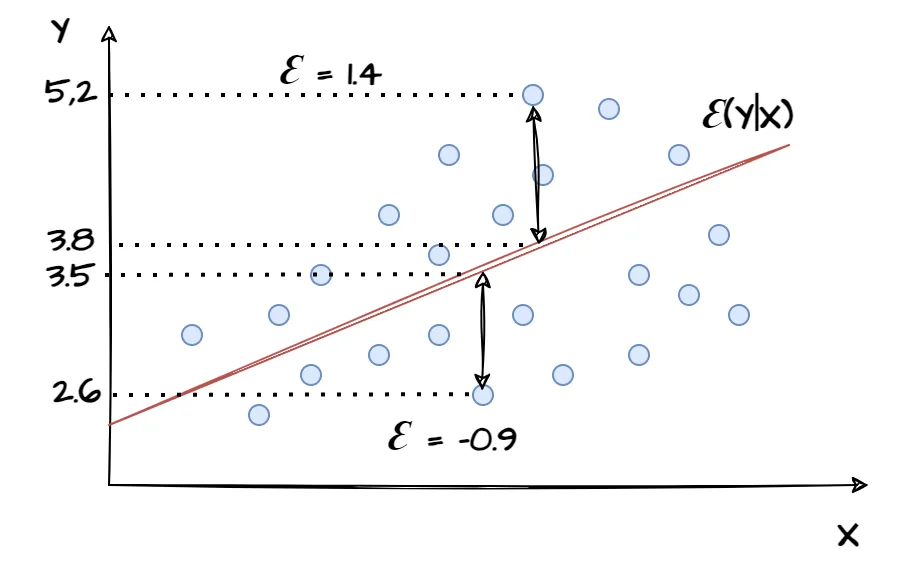{fig-align="center"}


## Covariance {.smaller}

**Evalue dans quelle mesure les variations de deux variables sont simultanées ou non.**

- "+" : les écarts entre les valeurs et leur moyenne ont tendance à être de même signe.
- "-" : les écarts entre les valeurs et leur moyenne ont tendance à être de signe opposé.
- "0" : les écarts entre les $Xi$ et leur moyenne et les écarts entre les $Yi$ et leur moyenne n'ont aucun lien entre eux.

**Attention** : 

- Sa dimension est le produit des dimensions des variables (e.g. euros et années), elle est donc difficile à interpréter.

- Davantage un outil qui permet d'effectuer d'autres calculs comme la corrélation de Pearson qu'un indicateur utilisé pour l'interprétation (c'est un peu comme la variance et l'écart type).

## Coefficient de corrélation linéaire (géométrique) de Pearson {.smaller}

**Evalue le degré de dépendance linéaire entre deux variables quantitatives ou si les points du nuage sont proches d'une droite. Le résultat dépend de la qualité de l'ajustement affine obtenu par une régression linéaire.**

**Intensité :**

- $r$ proche de 1 (ou -1) = forte corrélation linéaire des variables
- $r$ proche de 0 = indépendance des variables

**Sens de la relation :**

- $r>0$ = les variables évoluent dans le même sens
- $r<0$ = les variables évoluent dans le sens opposé.

⚠️ Corrélation $\neq$ causalité! [Quelques beaux exemples](https://tylervigen.com/spurious-scholar){target="_blank"}

⚠️ Multicolinéarité, quand plusieurs variables explicatives ont des liens de corrélation entre elles!

## Quelques exemples de corrélation

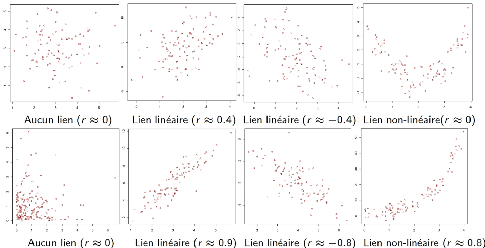{width="100%" fig-align="center"}

## Le Quartet d'Anscombe

```{r, echo=FALSE, fig.align='center'}
# Données du quartet d'Anscombe
data(anscombe)

# Passage au format long
anscombe_long <- bind_rows(
  data.frame(x = anscombe$x1, y = anscombe$y1, jeu = "I"),
  data.frame(x = anscombe$x2, y = anscombe$y2, jeu = "II"),
  data.frame(x = anscombe$x3, y = anscombe$y3, jeu = "III"),
  data.frame(x = anscombe$x4, y = anscombe$y4, jeu = "IV")
)

# Calcul des statistiques
stats <- anscombe_long %>%
  group_by(jeu) %>%
  summarise(
    r = cor(x, y, method = "pearson"),
    intercept = coef(lm(y ~ x))[1],
    pente = coef(lm(y ~ x))[2]
  ) %>%
  mutate(
    texte = paste0(
      "r = ", round(r, 3),
      "\ny = ", round(intercept, 2),
      ifelse(pente >= 0, " + ", " - "),
      round(abs(pente), 2), "x"
    )
  )

# Position des annotations
annotations <- anscombe_long %>%
  group_by(jeu) %>%
  summarise(
    x = min(x) + 0.5,
    y = max(y)
  ) %>%
  left_join(stats, by = "jeu")

# Graphique
# Position fixe des annotations
annotations <- stats %>%
  mutate(
    x = -Inf,
    y = Inf
  )

ggplot(anscombe_long, aes(x, y)) +
  geom_point(size = 3) +
  geom_smooth(method = "lm", se = FALSE, color = "red") +
  facet_wrap(~jeu, ncol = 2) +
  geom_text(
    data = annotations,
    aes(x = x, y = y, label = texte),
    hjust = -0.1,
    vjust = 1.1,
    size = 4,
    inherit.aes = FALSE
  ) +
  theme_bw() +
  labs(
    x = "x",
    y = "y"
  )
```

- ⚠️ Sensibilité aux valeurs extrêmes

- Moralité : toujours visualiser les données avant de les analyser ! 🧐

## Coefficient de corrélation de Spearman

- C'est le coefficient de Pearson appliqué aux rangs des variables.

- Similaire au coefficient de Pearson mais ne suppose pas de relation linéaire entre les variables. Il évalue si la relation monotone, qui ont tendance à se déplacer dans la même direction relative, entre deux variables indépendamment de la forme.

- L'interprétation est similaire à celle du coefficient de Pearson.

## Calcul des coefficients de corrélation

```{r, echo=TRUE, collapse=FALSE}
# r Pearson correlation
print(paste0("r = ", round(cor.test(carhyce_stat$largeur_mouillee_qb_m, carhyce_stat$debit_plein_bord_m3_s, method = "pearson")$estimate, 2)))
# rho Spearman correlation
print(paste0("rho = ", round(cor.test(carhyce_stat$largeur_mouillee_qb_m, carhyce_stat$debit_plein_bord_m3_s, method = "spearman")$estimate, 2)))
```
Intérêt de calculer les deux coefficients :

- r>$\rho$ : présence éventuelle de valeurs exceptionnelles.
- r<$\rho$ : présence éventuelle d'une relation non linéaire.

## Coefficient de détermination

**Le coefficient de détermination détermine le pourcentage de variation de Y imputable à X par le modèle, ou bien, la part de la dispersion totale expliquée par le modèle.**

\

$R^2$% des variations de Y s'expliquent par X.

Par exemple si $R^2 = 0.35$, 35% des variations de la largeur mouillée s'expliquent par le débit.

\

⚠️ Ne s'applique pas qu'aux modèles linéaires !

\

ℹ️ [Je vous recommande l'explication en vidéo de Tierry Ancelle sur le sujet](https://www.youtube.com/watch?v=XL3ZOuFxW4g){target="_blank"}

## Homosédasticité vs Hétérosédasticité

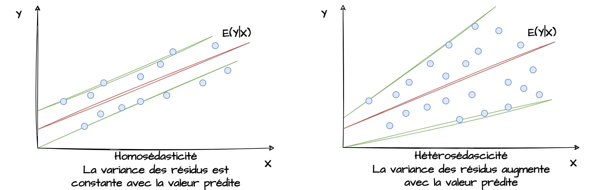

- **Homosédasticité** : la qualité du modèle est constante quelque soit la valeur de la variable explicative.
- **Hétérosédasticité** : la qualité du modèle varie en fonction de la valeur de la variable explicative.


## Lire le résultat d'un modèle de régression linéaire {.smaller}

::: columns
::: {.column width="50%"}

```{r, echo=TRUE, collapse=FALSE}
model_lineaire <- lm(largeur_mouillee_qb_m ~ debit_plein_bord_m3_s, 
                     data = carhyce_stat)
summary(model_lineaire)
```

:::
::: {.column width="50%"}
- Residuals : différence entre les valeurs observées et les valeurs prédites.
- Residual standard error : écart-type des résidus (ou la dispersion autour de la droite)
- Coefficients du modèle avec erreur standard et test de significativité  :

  - Intercept : l'ordonnée à l'origine
  - Nom de la variable : la pente

- R-squared : coefficient de détermination
- R-squared ajusted : R2 ajusté en fonction du nombre de variables explicatives
- F-statistic (ou test de Fisher) : test global de significativité du modèle

:::
:::

## Interprétation des résultats du modèle {.smaller}

::: columns
::: {.column width="50%"}

```{r, echo=TRUE, collapse=FALSE}
model_lineaire <- lm(largeur_mouillee_qb_m ~ debit_plein_bord_m3_s, 
                     data = carhyce_stat)
summary(model_lineaire)
```

:::
::: {.column width="50%"}

<details>
  <summary>Interprétation</summary>
[- La médiane des résidus est plutôt proche de 0 et les quartiles entre -3 et 2.Le modèle a tendance à sous-estimer légèrement les données observées, et 50% des valeurs observées sont relativement bien ajustée. L'erreur standard de 5m montre des écarts plus fort à la moyenne et donc de nombreuses observations moins bien prédites par le modèle.]{style="font-size: 0.7em;"}

[- Le modèle  prend la forme de l'équation $largeur = 7.54+0.39*Débit$ Les coefficients ont de faibles dispersions et une forte significativité, de même que le test de Fisher. Il existe bien une relation linéaire significative de la largeur en fonction du débit.]{style="font-size: 0.7em;"}

[- Le coefficient de détermination est de 0.44, soit 44% des variations de la largeur s'expliquent par le débit. Ce modèle linéaire sur le débit permet donc d'expliquer une partie importante de la variation de largeur mais d'autres variables sont nécessaire pour expliquer le reste des variations.]{style="font-size: 0.7em;"}
</details>

:::
:::

## Comparaison des modèles régressions

::: panel-tabset

### Linéaire

```{r, echo=TRUE, collapse=FALSE}
model_lineaire <- lm(largeur_mouillee_qb_m ~ debit_plein_bord_m3_s, data = carhyce_stat)
# equation
print(paste0("y = ", round(coef(model_lineaire)[1], 2), " + ", round(coef(model_lineaire)[2], 2), "x"))
# R2
print(paste0("R2 = ", round(summary(model_lineaire)$r.squared, 2)))
# Residual standard error
print(paste0("S = ", round(summary(model_lineaire)$sigma, 2)))
```

### Polynomiale
```{r, echo=TRUE, collapse=FALSE}
# polynomial model (degree 2)
model_poly <- lm(largeur_mouillee_qb_m ~ poly(debit_plein_bord_m3_s, 2), data = carhyce_stat)
# equation
print(paste0("y = ", round(coef(model_poly)[1], 2), " + ", round(coef(model_poly)[2], 2), "x + ", round(coef(model_poly)[3], 2), "x^2"))
# Residual standard error
print(paste0("S = ", round(summary(model_poly)$sigma, 2)))
```

### Logarithmique

```{r, echo=TRUE, collapse=FALSE}
# logarithmic model
model_log <- lm(largeur_mouillee_qb_m ~ log(debit_plein_bord_m3_s), data = carhyce_stat)
# equation
print(paste0("y = ", round(coef(model_log)[1], 2), " + ", round(coef(model_log)[2], 2), "log(x)"))
# Residual standard error
print(paste0("S = ", round(summary(model_log)$sigma, 2)))
```
:::

## Analyse des résidus {.smaller}

::: panel-tabset

### Linéaire

```{r, echo=TRUE, collapse=FALSE, fig.width=15}
plot(model_lineaire, which = 1)
```

### Polynomiale

```{r, echo=TRUE, collapse=FALSE, fig.width=15}
plot(model_poly, which = 1)
```

### Logarithmique

```{r, echo=TRUE, collapse=FALSE, fig.width=15}
plot(model_log, which = 1)
```

:::

Les résidus doivent être dispersés aléatoirement autour de zéro. La présence d’une tendance (linéaire ou non) indique des effets systématiques ignorés par le modèle. Le modèle est hétéroscédastique, sa qualité est moindre pour les valeurs les plus élevées. Le modèle a tendance à sous-estimer ces valeurs.

## Normalité des résidus (modèle linéaire) {.smaller}

```{r, echo=TRUE, collapse=FALSE, fig.height=3.2}
par(mfrow=c(1,2))
plot(model_lineaire, which = 2)
hist(model_lineaire$residuals, breaks = 100, main = "Histogramme des résidus", xlab = "Résidus")
```
<details>
  <summary>Analyse de la normalité</summary>
La distribution des résidus présente une sureprésentation des valeurs fortes par rapport à une distribution normale, soit une dissymétrie à droite. Les valeurs les plus élevées sont moins bien ajustées par le modèle.
</details>

## Régression linéaire multiple

Plusieurs variables explicatives pour une variable expliquée.

```{r, echo=TRUE, collapse=FALSE, out.height= 1}
# multiple linear regression with two variables
model_multiple <- lm(largeur_mouillee_qb_m ~ debit_plein_bord_m3_s + 
                       d50_mm + nombre_transect, 
                     data = carhyce_stat)
# equation
print(paste0("y = ", round(coef(model_multiple)[1], 2), " + ", 
                round(coef(model_multiple)[2], 2), "x1 + ", 
                round(coef(model_multiple)[3], 2), "x2 + ", 
                round(coef(model_multiple)[4], 2), "x3"))
```

## Régression linéaire multiple - interprétation {.smaller}

::: columns
::: {.column width="50%"}

```{r, echo=TRUE, collapse=FALSE}
summary(model_multiple)
```

:::
::: {.column width="50%"}

<details>
  <summary>Interprétation</summary>
- Les variables explicatives ont toutes un effet positif sur la largeur mouillée. L'ordonnée à l'origine et la coefficient directeur du nombre de transect ne sont pas significatif. Le nombre de transect est certainement à retirer de l'analyse dans ce contexte malgré le fait que la relation globale reste significative.
- Le débit, la granulométrie et le nombre de transect expliquent 50% de la variation de la largeur mouillée. La granulométrie est certainement un facteur explicatif pertinent mais le débit reste le facteur prédominant entre ces variables.
- Les résidus ont été faiblement réduits par rapport à la relation linéaire du débit seul.
</details>

:::
:::

## Régression linéaire multiple - synthèse

```{r, echo=TRUE, collapse=FALSE}
  gtsummary::tbl_regression(model_multiple, intercept = TRUE)
```

## Régression linéaire multiple - graphique en forêt

```{r, echo=TRUE, collapse=FALSE}
# forest plot
ggstats::ggcoef_model(model_multiple)
```

## Matrice de nuage de points

```{r, echo=TRUE, collapse=FALSE}
pairs(carhyce_stat[, c("debit_plein_bord_m3_s", "largeur_mouillee_qb_m", "d50_mm")])
```

## Corrélations croisées

```{r, echo=TRUE, collapse=FALSE}
pearson <- cor(carhyce_stat[, c("debit_plein_bord_m3_s", "largeur_mouillee_qb_m", "d50_mm")], method = "pearson")
pearson
```

[- Les corrélations linéaire les plus fortes sont entre le débit et la largeur mouillée. Le D50 est peu corrélé avec les autres variables (un peu avec la largeur mouillée). ]{style="font-size: 0.7em;"}

[- Si on prend la largeur mouillée comme variable expliquée, le débit et le D50 semblent être des variables explicatives intéressantes.]{style="font-size: 0.7em;"}

## Corrélations croisées - graphique

```{r, echo=TRUE, collapse=FALSE, fig.align='center'}
corrplot(pearson, 
         type = "upper",
         diag = FALSE,
         tl.col = "dark grey",
         tl.srt = 45)
```

# Comparaison de jeux de données

## Hypothèses et problématiques

Hypothèses : 

- Les stations CARHYCE sont représentatives de l'état des rivières françaises pour les petits bassins versants (<100 km2).
- Je peux distinguer les stations de montagne des stations de plaine par leur classification géographique.

Problématiques :

- Les rivières de montagne ont-elles des caractéristiques différentes des rivières de plaine pour les petits bassins versants ?


## Reprenons nos données {.smaller}

```{r, echo=TRUE, collapse=FALSE}
carhyce_stat <- carhyce %>% 
  # select the last date for each station
  group_by(code_station) %>% # group by station
  filter(date_realisation == max(date_realisation)) %>% # select the last date by group
  ungroup() %>%  # ungroup data
  filter(surface_bv_km2 < 100) %>% # keep surface_bv_km2 data below 100 km2
  mutate(surface_bv_km2 = ifelse(surface_bv_km2 %in% boxplot.stats(surface_bv_km2)$out, NA, surface_bv_km2),
         score_ripisylve = ifelse(score_ripisylve %in% boxplot.stats(score_ripisylve)$out, NA, score_ripisylve),
         profondeur_moyenne_qb_m = ifelse(profondeur_moyenne_qb_m %in% boxplot.stats(profondeur_moyenne_qb_m)$out, NA, profondeur_moyenne_qb_m),
         largeur_mouillee_qb_m = ifelse(largeur_mouillee_qb_m %in% boxplot.stats(largeur_mouillee_qb_m)$out, NA, largeur_mouillee_qb_m),
         surface_mouillee_qb_m2 = ifelse(surface_mouillee_qb_m2 %in% boxplot.stats(surface_mouillee_qb_m2)$out, NA, surface_mouillee_qb_m2),
         rayon_hydraulique_qb = ifelse(rayon_hydraulique_qb %in% boxplot.stats(rayon_hydraulique_qb)$out, NA, rayon_hydraulique_qb),
         d16_mm = ifelse(d16_mm %in% boxplot.stats(d16_mm)$out, NA, d16_mm),
         d50_mm = ifelse(d50_mm %in% boxplot.stats(d50_mm)$out, NA, d50_mm),
         d84_mm = ifelse(d84_mm %in% boxplot.stats(d84_mm)$out, NA, d84_mm),
         coefficient_de_sinuosite = ifelse(coefficient_de_sinuosite %in% boxplot.stats(coefficient_de_sinuosite)$out, NA, coefficient_de_sinuosite),
         coefficient_rugosite = ifelse(coefficient_rugosite %in% boxplot.stats(coefficient_rugosite)$out, NA, coefficient_rugosite),
         debit_plein_bord_m3_s = ifelse(debit_plein_bord_m3_s %in% boxplot.stats(debit_plein_bord_m3_s)$out, NA, debit_plein_bord_m3_s),
         vitesse_moyenne_qb_m_s = ifelse(vitesse_moyenne_qb_m_s %in% boxplot.stats(vitesse_moyenne_qb_m_s)$out, NA, vitesse_moyenne_qb_m_s),
         cote_ligne_energie_qb = ifelse(cote_ligne_energie_qb %in% boxplot.stats(cote_ligne_energie_qb)$out, NA, cote_ligne_energie_qb),
         nombre_de_froude_qb = ifelse(nombre_de_froude_qb %in% boxplot.stats(nombre_de_froude_qb)$out, NA, nombre_de_froude_qb),
         force_tractrice_qb_n_m2 = ifelse(force_tractrice_qb_n_m2 %in% boxplot.stats(force_tractrice_qb_n_m2)$out, NA, force_tractrice_qb_n_m2)) %>% # replace outliers by NA by Interquartile range (IQR) from boxplot function
  mutate(montagne_plaine = ifelse(modele_reference_img %in% c("ALPES INTERNES", "CEVENNES", "CORSE", "JURA-PREALPES DU NORD", "MASSIF CENTRAL NORD", "MASSIF CENTRAL SUD", "Montagne volcanique des DOM", "PREALPES DU SUD", "PYRENEES"), "montagne", "plaine")) %>% # try to classify in two category, montagne and plaine
  # select columns
  select(surface_bv_km2, 
         continuite_ripisylve_rive_gauche,
         continuite_ripisylve_rive_droite,
         score_ripisylve,
         profondeur_moyenne_qb_m,
         largeur_mouillee_qb_m,
         surface_mouillee_qb_m2,
         rayon_hydraulique_qb,
         d16_mm,
         d50_mm,
         d84_mm,
         coefficient_de_sinuosite,
         coefficient_rugosite,
         debit_plein_bord_m3_s,
         vitesse_moyenne_qb_m_s,
         cote_ligne_energie_qb,
         nombre_de_froude_qb,
         force_tractrice_qb_n_m2,
         modele_reference_img,
         montagne_plaine) %>%  # select columns
  na.omit() # remove NA values
```

## Théorème central limite

- Prennons un grand nombre d'échantillons de taille n d'une distribution non normale de moyenne $\mu$ et d'écart-type $\sigma$. Quelle est la distribution des moyennes si on effectue de nombreux tirage aléatoire de taille n?

- Illustration dans le [Grimoire de Lise Vaudor](http://perso.ens-lyon.fr/lise.vaudor/grimoireStat/_book/decrire-une-variable.html#loi-normale){target="_blank"}

- La moyenne d'un grand nombre d'échantillons (n>30) de distribution quelconque de taille $n$ s'approche d'une distribution normale $N$ de moyenne $\mu$ et d'écart-type $\sigma$, soit $\bar{x} \sim N(\mu, \frac{\sigma}{\sqrt{n}})$

::: aside

$\mu$ = moyenne de la population, $\sigma$ = écart-type de la population, $n$ = taille de l'échantillon

:::

## Erreur standard

- [L'écart type est un indicateur de la dispersion des valeurs d'un échantillon (ou d'une population) autour de la moyenne.]{style="font-size: 0.7em;"}

- [L'erreur standard est l'écart type d'un paramètre (moyenne, pourcentage, etc.). La moyenne de notre jeu de données (ou échantillon) n'est qu'une estimation de la moyenne de la population. Si on refaisait l'échantillonnage, on obtiendrait une autre moyenne à cause des fluctuations d'échantillonnage. L'erreur standard est l'écart type de ces moyennes.]{style="font-size: 0.7em;"}

- [L'erreur standard de la moyenne d'un échantillon peut être calculé : $\frac{\sigma}{\sqrt{n}}$. Il a donc la particularité de diminuer avec la racine carrée de la taille de l'échantillon, contrairement à l'écart type d'un échantillon.]{style="font-size: 0.7em;"}

::: aside

Une explication complète et très pédagogique est dans l'annexe 3 des [Statistiques pour statophobes (2004) de Denis Poinsot](https://perso.univ-rennes1.fr/denis.poinsot/Statistiques_%20pour_statophobes/STATISTIQUES%20POUR%20STATOPHOBES.pdf).

:::

## Intervalle de confiance de la moyenne (n>30, distribution quelconque) {.smaller}

- Un intervalle de confiance d'un paramètre est un intervalle dans lequel on estime que le paramètre se trouve avec une certaine probabilité.

- Selon le théorème central limite, la moyenne calculé sur un grand échantillon $\bar x$ suit une loi approximativement normale de moyenne (de la population) $\mu$ et d'écart type (ou erreur standard) $\frac{\sigma}{\sqrt{n}}$.

- Nous avons un grand échantillon (n>30), l'écart-type de l'échantillon est donc une bonne estimation de l'écart-type de la population.

- Dans une distribution normale, 95% des valeurs se trouvent dans l'intervalle $IC_{95\%} = [\bar x-1.96\frac{s}{\sqrt{n}},\bar x+1.96\frac{s}{\sqrt{n}}]$. La moyenne de l'échantillon a 95% de chance de se trouver dans cet intervalle. On peut remplacer 1.96 par une autre valeur critique de la loi normale avec son niveau de confiance associé ($IC_{99\%}$, la valeur critique est de 2.575).

::: aside

$\mu$ = moyenne de la population, $\bar x$ = moyenne de l'échantillon, $\sigma$ = écart-type de la population, $s$ = écart-type de l'échantillon, $n$ = taille de l'échantillon

:::

## Intervalle de confiance de la moyenne (n<30, distribution normale) {.smaller}

- La distribution est normale mais on ne peut plus remplacer l'écart-type de la population $\sigma$ par l'écart-type de l'échantillon $s$. L'écart-type de la population est alors remplacé par le $t$ de Student pour $n-1$ degrés de liberté (df ou degrees of freedom en anglais). William Sealy Gosset sous le nom de Student puis Ronald Fisher ont démontré que le rapport $t = \frac{\bar x - \mu}{s/\sqrt{n}}$ suit une loi de Student à $n-1$ degrés de liberté.

- L'intervalle de confiance est alors pour $IC_{95\%} = [\bar x-t_{0.975}\frac{s}{\sqrt{n}},\bar x+t_{0.975}\frac{s}{\sqrt{n}}]$. On peut remplacer $t_{0.975}$ par n'importe quelle valeur critique de la loi de Student pour son niveau de confiance associé.

## Intervalle de confiance de la moyenne (n>30 ou distribution normale) - calcul

```{r, echo=TRUE, collapse=FALSE}
# mean confidence interval for the sample with 95% confidence level
t.test(carhyce_stat$largeur_mouillee_qb_m, 
       conf.level = 0.95)
```

## Intervalle de confiance de la moyenne (n<30, distribution non normale) {.smaller}

- La méthode du bootstrap : on simule d'une manière itérative une multitude d'échantillons analogues à l'échantillon initial. On génère une multitude de pseudo-échantillons à partir de l'échantillon initial (avec remise).

- Exemple : prenons un échantillon $x = [1,2,3,4,5,6,7,8,9]$. Un pseudo-échantillon pourrait être $x_1 = [2,3,3,5,6,7,7,8,9]$ (avec remise => plusieurs 3 et 7).

- On calcule la moyenne de chaque échantillon et on obtient la distribution des moyennes. L'intervalle de confiance est alors déterminé par les quantiles de cette distribution.

## Bootstrap sur une moyenne

```{r, echo=TRUE, collapse=FALSE}
# sample 20 values from the population
sample_largeur <- sample(carhyce_stat$largeur_mouillee_qb_m, 20)
print(paste0("Moyenne du sous échantillon = ", mean(sample_largeur)))
```
```{r, echo=TRUE, collapse=FALSE}
bootstat <- function(x, i) mean(x[i]) # bootstrap function
# mean confidence interval for the sample with 95% confidence level
mean_ci_sample <- boot(data = sample_largeur, 
                       statistic = bootstat, R = 1000)
boot.ci(mean_ci_sample, type = "basic", conf = 0.95)
```
## Intervalle de confiance d'une médiane

- La méthode du bootstrap peut être utilisée.

```{r, echo=TRUE, collapse=FALSE}
print(paste0("Médiane = ", median(carhyce_stat$largeur_mouillee_qb_m)))
bootstat <- function(x, i) median(x[i]) # bootstrap function
# mean confidence interval for the sample with 95% confidence level
median_ci_sample <- boot(data = carhyce_stat$largeur_mouillee_qb_m, 
                         statistic = bootstat, R = 1000)
boot.ci(median_ci_sample, type = "basic", conf = 0.95)
```

```{r, echo=FALSE, include=FALSE}
# Median confidence interval for symmetric distribution 
wilcox.test(carhyce_stat$largeur_mouillee_qb_m, conf.int = TRUE)
```

## Intervalle de confiance - synthèse

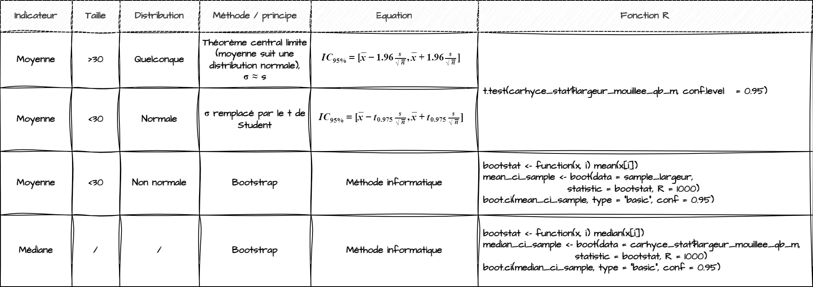{width="100%" fig-align="center"}

## Test de comparaison des moyennes {.smaller}

Est-ce que les moyennes de deux échantillons sont significativement différentes : 

- Tests paramétriques (distribution normale **ou** n>30) :

  - Test de Student (t-test) : deux échantillons de variances égales.
  - Test de Welch : deux échantillons de variances différentes.
  
- Test non paramétrique (distribution non-normale **et** n<30) :

  - Test de Wilcoxon (apparié) Mann-Whitney (non apparié).
  
Si la distribution est très dissymétrique malgrés un échantillon >30, un test non paramétrique est préférable.

Les tests ont des variantes selon l'indépendance des variables. Non-apparié => échantillons indépendants (e.g. comparaison de largeur de cours d'eau entre le bassin du Rhône et de la Loire), apparié => échantillons dépendants (e.g. comparaison de concentration en nitrates avant traitement et après traitement de l'eau au même moment, comparaison point par point).

*"two.sided", "less", "greater" sont les options pour le test bilatéral, unilatéral inférieur ou unilatéral supérieur selon si l'on souhaite tester si les moyennes sont différentes, si une moyenne est inférieure ou si une moyenne est supérieure.*

## Choix du test de comparaison des moyennes

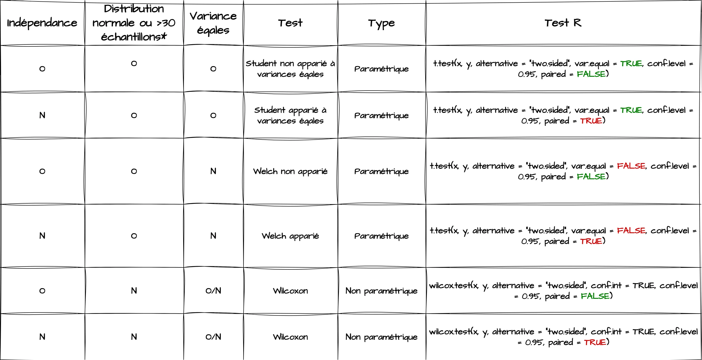{width="100%" fig-align="center"}

<!-- ## Conditions de comparaison des moyennes -->

[*Si la distribution est très dissymétrique malgrés un échantillon >30 => test non paramétrique.]{style="font-size: 0.7em;"}


## Comparaison des stations de plaine et de montagne

**Est-ce que les rivières de montagne ont une granulométrie plus grossière que les rivières de plaine?**

\

Séparation des jeux de données.

```{r, echo=TRUE, collapse=FALSE}
carhyce_stat_montagne <- carhyce_stat %>% filter(montagne_plaine == "montagne")
carhyce_stat_montagne_mean = mean(carhyce_stat_montagne$d50_mm, na.rm = TRUE)
print(paste0("Moyenne D50 station de montagne = ", round(carhyce_stat_montagne_mean, 2)))
```

```{r, echo=TRUE, collapse=FALSE}
carhyce_stat_plaine <- carhyce_stat %>% filter(montagne_plaine == "plaine")
carhyce_stat_plaine_mean = mean(carhyce_stat_plaine$d50_mm, na.rm = TRUE)
print(paste0("Moyenne D50 station de plaine = ", round(carhyce_stat_plaine_mean, 2)))
```
## Vérification des distributions - code

```{r, echo=TRUE, eval=FALSE}
# histogram with normal curve
par(mfrow=c(1,2))
h <- hist(carhyce_stat_montagne$d50_mm, col = "lightblue", main = "Montagne", 
          xlab = "D50 (mm)", ylim = c(0, 20))
xfit <- seq(min(carhyce_stat_montagne$d50_mm),
            max(carhyce_stat_montagne$d50_mm), length = 40) 
yfit <- dnorm(xfit, mean = mean(carhyce_stat_montagne$d50_mm), sd = sd(carhyce_stat_montagne$d50_mm)) 
yfit <- yfit * diff(h$mids[1:2]) * length(carhyce_stat_montagne$d50_mm) 
lines(xfit, yfit, col = "red", lwd = 2)
h <- hist(carhyce_stat_plaine$d50_mm, col = "lightgreen", main = "Plaine", 
          xlab = "D50 (mm)")
xfit <- seq(min(carhyce_stat_plaine$d50_mm),
            max(carhyce_stat_plaine$d50_mm), length = 40)
yfit <- dnorm(xfit, mean = mean(carhyce_stat_plaine$d50_mm), sd = sd(carhyce_stat_plaine$d50_mm))
yfit <- yfit * diff(h$mids[1:2]) * length(carhyce_stat_plaine$d50_mm)
lines(xfit, yfit, col = "red", lwd = 2)
```

## Vérification des distributions

```{r, echo=FALSE, fig.align='center'}
# histogram with normal curve
par(mfrow=c(1,2))
h <- hist(carhyce_stat_montagne$d50_mm, col = "lightblue", main = "Montagne", 
          xlab = "D50 (mm)", ylim = c(0, 20))
xfit <- seq(min(carhyce_stat_montagne$d50_mm),
            max(carhyce_stat_montagne$d50_mm), length = 40) 
yfit <- dnorm(xfit, mean = mean(carhyce_stat_montagne$d50_mm), sd = sd(carhyce_stat_montagne$d50_mm)) 
yfit <- yfit * diff(h$mids[1:2]) * length(carhyce_stat_montagne$d50_mm) 
lines(xfit, yfit, col = "red", lwd = 2)
h <- hist(carhyce_stat_plaine$d50_mm, col = "lightgreen", main = "Plaine", 
          xlab = "D50 (mm)")
xfit <- seq(min(carhyce_stat_plaine$d50_mm),
            max(carhyce_stat_plaine$d50_mm), length = 40)
yfit <- dnorm(xfit, mean = mean(carhyce_stat_plaine$d50_mm), sd = sd(carhyce_stat_plaine$d50_mm))
yfit <- yfit * diff(h$mids[1:2]) * length(carhyce_stat_plaine$d50_mm)
lines(xfit, yfit, col = "red", lwd = 2)
```


## Comparaison de moyennes - IC95%

```{r, echo=TRUE, collapse=FALSE}
print(paste0("Taille de l'échantillon montagne : ", nrow(carhyce_stat_montagne)))
print(paste0("Taille de l'échantillon plaine : ", nrow(carhyce_stat_plaine)))
```
\

[Condition n>30, distribution quelconque]{style="font-size: 0.7em;"}

```{r, echo=TRUE, collapse=FALSE}
# mean confidence interval with 95% confidence level
montagne_t_test <- t.test(carhyce_stat_montagne$d50_mm, conf.level = 0.95)
print(paste0("Montagne mean ", round(carhyce_stat_montagne_mean, 2), " IC95% = ", "[", round(montagne_t_test$conf.int[1], 2), " - ", round(montagne_t_test$conf.int[2], 2), "]"))
plaine_t_test <- t.test(carhyce_stat_plaine$d50_mm, conf.level = 0.95)
print(paste0("Plaine mean ", round(carhyce_stat_plaine_mean, 2), " IC95% = ", "[", round(plaine_t_test$conf.int[1], 2), " - ", round(plaine_t_test$conf.int[2], 2), "]"))
```
## Comparaison de moyennes - IC boxplot

```{r, echo=TRUE, collapse=FALSE, fig.align='center'}
# boxplot with mean, confidence interval and their values
boxplot(carhyce_stat$d50_mm ~ carhyce_stat$montagne_plaine, main = "Granulométrie d50", xlab = "", ylab = "Granulométrie d50 (mm)", col = c("lightblue", "lightgreen"))
points(1, carhyce_stat_montagne_mean, pch = 19, col = "red")
segments(1, montagne_t_test$conf.int[1], 1, montagne_t_test$conf.int[2], col = "red")
points(2, carhyce_stat_plaine_mean, pch = 19, col = "red")
segments(2, plaine_t_test$conf.int[1], 2, plaine_t_test$conf.int[2], col = "red")
text(1, montagne_t_test$conf.int[2], paste0(round(carhyce_stat_montagne_mean, 2), " [", round(montagne_t_test$conf.int[1], 2), " - ", round(montagne_t_test$conf.int[2], 2), "]"), pos = 3) # 
text(2, plaine_t_test$conf.int[2], paste0(round(carhyce_stat_plaine_mean, 2), " [", round(plaine_t_test$conf.int[1], 2), " - ", round(plaine_t_test$conf.int[2], 2), "]"), pos = 3) # add values of means and confidence intervals
abline(h = 35, col = "red") # add horizontal line at 35 mm
```
## Test de comparaison des variances - F-test {.smaller}

F-test pour comparer les variances :

- $H_0$ : les variances sont égales
- $H_1$ : les variances ne sont pas égales

```{r, echo=TRUE, collapse=FALSE}
# F-test
var.test(carhyce_stat_montagne$d50_mm, carhyce_stat_plaine$d50_mm)
```
<details>
  <summary>Interprétation</summary>
  La p-value < 0.05, l'hypothèse nulle est rejetée, les variances des granulométries des rivières de montagne et de plaine sont significativement différentes.
</details>

## Test de comparaison des moyennes - choix du test {.smaller}

Caractéristiques des données plaine et montagne :

- Deux sous-populations indépendantes (deux zones géographiques différentes)
- Les variances sont différentes
- Taille des stations de montagne et de plaine > 30

<details>
  <summary>Test de comparaison des moyennes</summary>

=> Test de Welch non apparié pour comparer les moyennes de deux échantillons indépendants de variances différentes. (le t.test de R réalise toujours un test de variance et change pour le test de Welch si les variances sont différentes) :

- $H_0$ : les moyennes des deux échantillons sont égales.

- $H_1$ : les moyennes des deux échantillons sont différentes.

</details>

## Test de comparaison des moyennes - Welch t-test
    
```{r, echo=TRUE, collapse=FALSE}
# Welch test
t.test(carhyce_stat_montagne$d50_mm, carhyce_stat_plaine$d50_mm,
       var.equal = FALSE, # Welch test
       alternative = "two.sided", # test difference of means
       paired = FALSE, # independant samples
       conf.level = 0.99) # 99% confidence level
```
<details>
  <summary>Interprétation</summary>
  [La p-value est inférieure à 0.01, l'hypothèse nulle est rejetée, les moyennes des granulométries des rivières de montagne et de plaine sont significativement différentes avec (risque $\alpha = 1$%)]{style="font-size: 0.7em;"}
</details>

## Petits échantillons ou distributions non normales

Etudes des Vosges et des Plaine/collinéen calcaire.

```{r, echo=TRUE, collapse=FALSE}
# montagne data with only PYRENEES
carhyce_stat_montagne_vosges <- carhyce_stat %>% filter(modele_reference_img == "VOSGES")
# dataset dimension and mean
print(paste0("n = ", dim(carhyce_stat_montagne_vosges)[1]))
print(paste0("Moyenne Vosges = ", mean(carhyce_stat_montagne_vosges$d50_mm, na.rm = TRUE)))
```

```{r, echo=TRUE, collapse=FALSE}
carhyce_stat_plaine_collineen <- carhyce_stat %>% filter(modele_reference_img == "Plaine/collinéen calcaire")
# dataset dimension and mean
print(paste0("n = ", dim(carhyce_stat_plaine_collineen)[1]))
print(paste0("Moyenne = ", mean(carhyce_stat_plaine_collineen$d50_mm, na.rm = TRUE)))
```

## Vérification des distributions - Code

```{r, echo=TRUE, eval=FALSE}
# histogram with normal curve
par(mfrow=c(1,2))
h <- hist(carhyce_stat_montagne_vosges$d50_mm, col = "lightblue", main = "Vosges", 
          xlab = "D50 (mm)", ylim = c(0, 20))
xfit <- seq(min(carhyce_stat_montagne_vosges$d50_mm),
            max(carhyce_stat_montagne_vosges$d50_mm), length = 40)
yfit <- dnorm(xfit, mean = mean(carhyce_stat_montagne_vosges$d50_mm), sd = sd(carhyce_stat_montagne_vosges$d50_mm))
yfit <- yfit * diff(h$mids[1:2]) * length(carhyce_stat_montagne_vosges$d50_mm)
lines(xfit, yfit, col = "red", lwd = 2)
h <- hist(carhyce_stat_plaine_collineen$d50_mm, col = "lightgreen", main = "Plaine/collinéen calcaire", 
          xlab = "D50 (mm)")
xfit <- seq(min(carhyce_stat_plaine_collineen$d50_mm),
            max(carhyce_stat_plaine_collineen$d50_mm), length = 40)
yfit <- dnorm(xfit, mean = mean(carhyce_stat_plaine_collineen$d50_mm), sd = sd(carhyce_stat_plaine_collineen$d50_mm))
yfit <- yfit * diff(h$mids[1:2]) * length(carhyce_stat_plaine_collineen$d50_mm)
lines(xfit, yfit, col = "red", lwd = 2)
```

## Vérification des distributions

```{r, echo=FALSE, fig.align='center'}
# histogram with normal curve
par(mfrow=c(1,2))
h <- hist(carhyce_stat_montagne_vosges$d50_mm, col = "lightblue", main = "Vosges", 
          xlab = "D50 (mm)", ylim = c(0, 20))
xfit <- seq(min(carhyce_stat_montagne_vosges$d50_mm),
            max(carhyce_stat_montagne_vosges$d50_mm), length = 40)
yfit <- dnorm(xfit, mean = mean(carhyce_stat_montagne_vosges$d50_mm), sd = sd(carhyce_stat_montagne_vosges$d50_mm))
yfit <- yfit * diff(h$mids[1:2]) * length(carhyce_stat_montagne_vosges$d50_mm)
lines(xfit, yfit, col = "red", lwd = 2)
h <- hist(carhyce_stat_plaine_collineen$d50_mm, col = "lightgreen", main = "Plaine/collinéen calcaire", 
          xlab = "D50 (mm)")
xfit <- seq(min(carhyce_stat_plaine_collineen$d50_mm),
            max(carhyce_stat_plaine_collineen$d50_mm), length = 40)
yfit <- dnorm(xfit, mean = mean(carhyce_stat_plaine_collineen$d50_mm), sd = sd(carhyce_stat_plaine_collineen$d50_mm))
yfit <- yfit * diff(h$mids[1:2]) * length(carhyce_stat_plaine_collineen$d50_mm)
lines(xfit, yfit, col = "red", lwd = 2)
```

## Vérification des distributions - test de Shapiro-Wilk

```{r, echo=TRUE, collapse=FALSE}
# Shapiro-Wilk test - Vosges
shapiro.test(carhyce_stat_montagne_vosges$d50_mm)
# Shapiro-Wilk test - Plaine/collinéen calcaire
shapiro.test(carhyce_stat_plaine_collineen$d50_mm)
```
<details>
  <summary>Interprétation</summary>
  [Pour l'échantillon des Vosges, la p-value < 0.05, l'hypothèse nulle de normalité est rejetée. Pour l'échantillon de plaine/collinéen calcaire, la p-value > 0.05, on accepte l'hypothèse nulle de normalité même si le peu d'individus rend l'interprétation des graphiques difficiles.]{style="font-size: 0.7em;"}
</details>

## Mes variances sont-elles égales?

[F-test pour comparer les variances (seuil de significativité = 0.05)]{style="font-size: 0.7em;"}

[- $H_0$ : les variances sont égales]{style="font-size: 0.7em;"}
[- $H_1$ : les variances sont différentes]{style="font-size: 0.7em;"}

```{r, echo=TRUE, collapse=FALSE}
# F-test
var.test(carhyce_stat_montagne_vosges$d50_mm, carhyce_stat_plaine_collineen$d50_mm)
```
<details>
  <summary>Interprétation</summary>
  La p-value est supérieure à 0.05, on accepte l'hypothèse d'égalité des variances.
</details>

## Comparaison des moyennes - choix du test {.smaller}

Caractéristiques Vosges et stations de plaine/collinéen calcaire : 

- Deux sous-populations indédendantes (deux régions géographiques différentes).
- Les variances sont égales.
- Taille de Vosges > 30, distribution non normale.
- Taille de plaine/collinéen calcaire < 30, distribution normale.

Hypothèses : 

- $H_0$ : les moyennes des deux granulométries sont égales.
- $H_1$ : les moyennes des deux granulométries sont différentes.

<details>
  <summary>Test de comparaison des moyennes</summary>
  => Test de Student non apparié à variance égale (seuil de significativité de 5%)
</details>

## Comparaison des moyennes - test de Student

```{r, echo=TRUE, collapse=FALSE}
# t test
t.test(carhyce_stat_montagne_vosges$d50_mm, carhyce_stat_plaine_collineen$d50_mm,
       var.equal = TRUE, # equal variance
       alternative = "two.sided", # test difference of means
       paired = FALSE, # independant samples
       conf.level = 0.95) # 95% confidence level
```
<details>
  <summary>Interprétation</summary>
  [p-value > 0.05, on accepte l'hypothèse nulle, les moyennes des granulométries sont égales. **Ou plus exactement** les données ne permettent pas de conclure à une différence significative.]{style="font-size: 0.7em;"}
</details>

## Comparaison des moyennes - IC95%

Caractéristiques Vosges et stations de plaine/collinéen calcaire : 

- Taille de Vosges > 30 : Théorème central limite $s \approx \sigma$.
- Taille de plaine/collinéen calcaire < 30, distribution normale : $\sigma$ remplacé par $t$ de Student.

::: columns
::: {.column width="50%"}

```{r, echo=TRUE, collapse=FALSE}
# IC95% Vosges
t.test(carhyce_stat_montagne_vosges$d50_mm, conf.level = 0.95)
```

:::
::: {.column width="50%"}

```{r, echo=TRUE, collapse=FALSE}
# IC95% Plaine/collinéen calcaire
t.test(carhyce_stat_plaine_collineen$d50_mm, conf.level = 0.95)
```
:::
:::

## Comparaison des moyennes - IC95% boxplot {.smaller}

```{r, echo=TRUE, collapse=FALSE, fig.align='center'}
# boxplot with mean, confidence interval and their values
boxplot(carhyce_stat_montagne_vosges$d50_mm, carhyce_stat_plaine_collineen$d50_mm, main = "Granulométrie d50", xlab = "", ylab = "Granulométrie d50 (mm)", col = c("lightblue", "lightgreen"), names = c("Vosges", "Plaine/collinéen calcaire"))
points(1, mean(carhyce_stat_montagne_vosges$d50_mm, na.rm = TRUE), pch = 19, col = "red")
segments(1, t.test(carhyce_stat_montagne_vosges$d50_mm, conf.level = 0.95)$conf.int[1], 1, t.test(carhyce_stat_montagne_vosges$d50_mm, conf.level = 0.95)$conf.int[2], col = "red")
points(2, mean(carhyce_stat_plaine_collineen$d50_mm, na.rm = TRUE), pch = 19, col = "red")
segments(2, t.test(carhyce_stat_plaine_collineen$d50_mm, conf.level = 0.95)$conf.int[1], 2, t.test(carhyce_stat_plaine_collineen$d50_mm, conf.level = 0.95)$conf.int[2], col = "red")
text(1, t.test(carhyce_stat_montagne_vosges$d50_mm, conf.level = 0.95)$conf.int[2], paste0(round(mean(carhyce_stat_montagne_vosges$d50_mm, na.rm = TRUE), 2), " [", round(t.test(carhyce_stat_montagne_vosges$d50_mm, conf.level = 0.95)$conf.int[1], 2), " - ", round(t.test(carhyce_stat_montagne_vosges$d50_mm, conf.level = 0.95)$conf.int[2], 2), "]"), pos = 3)
text(2, t.test(carhyce_stat_plaine_collineen$d50_mm, conf.level = 0.95)$conf.int[2], paste0(round(mean(carhyce_stat_plaine_collineen$d50_mm, na.rm = TRUE), 2), " [", round(t.test(carhyce_stat_plaine_collineen$d50_mm, conf.level = 0.95)$conf.int[1], 2), " - ", round(t.test(carhyce_stat_plaine_collineen$d50_mm, conf.level = 0.95)$conf.int[2], 2), "]"), pos = 3)
```
# Analyse multivariée / multidimensionnelle

## Principe d'une analyse multivariée {.smaller}

J'ai une banane, c'est un objet 3D que je souhaite représenter en 2D. Quel angle choisir pour avoir quelque chose de "reconnaissable" ?

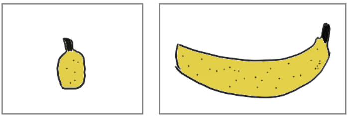{width="60%" fig-align="center"}

Ma banane de droite est bien plus reconnaissable que celle de gauche. L'angle choisie permet de reconnaitre l'aspect allongé et courbé de la banane. La couleur est aussi une information complémentaire utile pour l'interprétation.

L'objectif d'une analyse multivariée est de trouver un plan (définis par deux axes) avec le plus d'information possible pour avoir une vue d'ensemble du comportement ou de la structure de nos données.

::: aside
Cette analogie, l'image et l'explication sont reprises du blog de Lise Vaudor [Lise Vaudor, CNRS, 2021](http://perso.ens-lyon.fr/lise.vaudor/acp/){target="_blank"}
:::

## Analyse multivariée / multidimensionnelle {.smaller}

- L'objectif est de synthétiser et de structurer l'information contenue dans des données multidimensionnelles (I individus, K variables) => méthode d'exploration des données.

| Analyse    | Variables                                        | Fonction standard      | Fonction ade4          | Fonctions FactoMineR    |
|----------------|--------------------------------------------------|------------------------|------------------------|-------------------------|
| ACP            | plusieurs variables quantitatives                | stats::princomp()      | ade4::dudi.pca()       | FactoMineR::PCA()       |
| AFC            | deux variables qualitatives                      | MASS::corresp()        | ade4::dudi.coa()       | FactoMineR::CA()        |
| ACM            | plusieurs variables qualitatives                 | MASS::mca()            | ade4::dudi.acm()       | FactoMineR::MCA()       |
| Analyse mixte  | plusieurs variables quantitatives et/ou qualitatives | —                      | ade4::dudi.mix()       | FactoMineR::FAMD()      |

::: aside
Source tableau : [Joseph Larmarange 2024](https://larmarange.github.io/guide-R/analyses_avancees/analyse-factorielle.html){target="_blank"}
:::

## Etude des individus et des variables

- Analyse de la variabilité entre les individus : 
  - Quels sont leurs caractéristiques communes ?
  - Peut-on identifier des profils d'individus ?

- Analyse des variables :
  - Quels sont les liaisons entre les variables ?
  - Peut-on identifier des groupes de variables ?
  
- exemples : 30 individus et 4 variables : 
  - les variables ont 30 dimensions dans l'espace des individus.
  - les individus ont 4 dimensions dans l'espace des variables.
  
## Reprenons nos données {.smaller}

```{r, echo=TRUE, collapse=FALSE}
carhyce_stat <- carhyce %>% 
  # select the last date for each station
  group_by(code_station) %>% # group by station
  filter(date_realisation == max(date_realisation)) %>% # select the last date by group
  ungroup() %>%  # ungroup data
  mutate(surface_bv_km2 = ifelse(surface_bv_km2 %in% boxplot.stats(surface_bv_km2)$out, NA, surface_bv_km2),
         score_ripisylve = ifelse(score_ripisylve %in% boxplot.stats(score_ripisylve)$out, NA, score_ripisylve),
         profondeur_moyenne_qb_m = ifelse(profondeur_moyenne_qb_m %in% boxplot.stats(profondeur_moyenne_qb_m)$out, NA, profondeur_moyenne_qb_m),
         largeur_mouillee_qb_m = ifelse(largeur_mouillee_qb_m %in% boxplot.stats(largeur_mouillee_qb_m)$out, NA, largeur_mouillee_qb_m),
         surface_mouillee_qb_m2 = ifelse(surface_mouillee_qb_m2 %in% boxplot.stats(surface_mouillee_qb_m2)$out, NA, surface_mouillee_qb_m2),
         rayon_hydraulique_qb = ifelse(rayon_hydraulique_qb %in% boxplot.stats(rayon_hydraulique_qb)$out, NA, rayon_hydraulique_qb),
         d16_mm = ifelse(d16_mm %in% boxplot.stats(d16_mm)$out, NA, d16_mm),
         d50_mm = ifelse(d50_mm %in% boxplot.stats(d50_mm)$out, NA, d50_mm),
         d84_mm = ifelse(d84_mm %in% boxplot.stats(d84_mm)$out, NA, d84_mm),
         coefficient_de_sinuosite = ifelse(coefficient_de_sinuosite %in% boxplot.stats(coefficient_de_sinuosite)$out, NA, coefficient_de_sinuosite),
         coefficient_rugosite = ifelse(coefficient_rugosite %in% boxplot.stats(coefficient_rugosite)$out, NA, coefficient_rugosite),
         debit_plein_bord_m3_s = ifelse(debit_plein_bord_m3_s %in% boxplot.stats(debit_plein_bord_m3_s)$out, NA, debit_plein_bord_m3_s),
         vitesse_moyenne_qb_m_s = ifelse(vitesse_moyenne_qb_m_s %in% boxplot.stats(vitesse_moyenne_qb_m_s)$out, NA, vitesse_moyenne_qb_m_s),
         cote_ligne_energie_qb = ifelse(cote_ligne_energie_qb %in% boxplot.stats(cote_ligne_energie_qb)$out, NA, cote_ligne_energie_qb),
         nombre_de_froude_qb = ifelse(nombre_de_froude_qb %in% boxplot.stats(nombre_de_froude_qb)$out, NA, nombre_de_froude_qb),
         force_tractrice_qb_n_m2 = ifelse(force_tractrice_qb_n_m2 %in% boxplot.stats(force_tractrice_qb_n_m2)$out, NA, force_tractrice_qb_n_m2)) %>% # replace outliers by NA by Interquartile range (IQR) from boxplot function
  mutate(montagne_plaine = ifelse(modele_reference_img %in% c("ALPES INTERNES", "CEVENNES", "CORSE", "JURA-PREALPES DU NORD", "MASSIF CENTRAL NORD", "MASSIF CENTRAL SUD", "Montagne volcanique des DOM", "PREALPES DU SUD", "PYRENEES"), "montagne", "plaine")) %>% # try to classify in two category, montagne and plaine
  # select columns
  select(surface_bv_km2, 
         continuite_ripisylve_rive_gauche,
         continuite_ripisylve_rive_droite,
         score_ripisylve,
         profondeur_moyenne_qb_m,
         largeur_mouillee_qb_m,
         surface_mouillee_qb_m2,
         rayon_hydraulique_qb,
         d16_mm,
         d50_mm,
         d84_mm,
         coefficient_de_sinuosite,
         coefficient_rugosite,
         debit_plein_bord_m3_s,
         vitesse_moyenne_qb_m_s,
         cote_ligne_energie_qb,
         nombre_de_froude_qb,
         force_tractrice_qb_n_m2,
         montagne_plaine) # select columns
```

## Analyse en composantes principales (ACP)

**ACP sur tous les individus et toutes les variables :**

```{r, echo=TRUE, collapse=FALSE, warning=FALSE}
# PCA
pca <- PCA(carhyce_stat[, c("score_ripisylve", "profondeur_moyenne_qb_m", "largeur_mouillee_qb_m", "surface_mouillee_qb_m2", "rayon_hydraulique_qb", "d16_mm", "d50_mm", "d84_mm", "coefficient_de_sinuosite", "coefficient_rugosite", "debit_plein_bord_m3_s", "vitesse_moyenne_qb_m_s", "cote_ligne_energie_qb", "nombre_de_froude_qb", "force_tractrice_qb_n_m2")], 
            ncp = Inf, # number of dimensions
            scale.unit = TRUE, # reduce
            graph = FALSE) # not display graph
print(pca)
```

## ACP - Vocabulaire et information

- **eig** : eigenvalues (valeurs propres)
- **ind** : individus
- **var** : variables
- **coord** : coordonnées dans l'espace des individus ou des variables
- **cos2** : qualité de représentation d'un individu ou d'une variable
- **contrib** : contribution d'un individu ou d'une variable au calcul de l'axe

## Centrage et réduction

- Les variables sont souvent exprimées dans des unités différentes, les effets d'échelles les rendent difficile à comparer.

- On les centre : on soustrait la moyenne de chaque variable à chaque observation.

- On les réduit : on divise par l'écart-type de chaque variable.

- On obtient des variables centrées-réduites, qui ont une moyenne nulle et une variance égale à 1.

## Dimension des individus et des variables {.smaller}

- Espace des individus (un individus caractérisé par X variables) : 
```{r, echo=FALSE}
# individus
head(carhyce_stat, n=3)
```

- Espace des variables (une variable caractérisée par X individus) : 
```{r, echo=FALSE}
# transpose dataframe
carhyce_stat_transposed <- as.data.frame(t(carhyce_stat[, -1]))
head(carhyce_stat_transposed, n=3)
```

## ACP - Analyse des valeurs propres

- Quantité de variance expliquée par chaque axe (ou inertie). Deux axes nous permettent de visualiser les données en 2D.

```{r, echo=TRUE, collapse=FALSE}
head(pca$eig)
```
<details>
  <summary>Interprétation</summary>
  [Le premier axe explique 30% de la variance. Les trois premiers axes permettent d'expliquer 61% de la variance. On va donc s'intéresser à ces trois axes pour représenter l'information. Un plan (2D) avec les deux premiers axes permet de représenter 47 % de l'information d'un jeu de données en 15 dimensions (15 variables quantitatives).]{style="font-size: 0.7em;"}
</details>

## ACP - Analyse graphique des valeurs propres

[Peut-on résumer l'essentiel de l'information avec un nombre réduit de dimensions (ou axes) ? => On cherche des "coude" ou points d'inflexion.]{style="font-size: 0.7em;"}

::: columns
::: {.column width="70%"}

```{r, echo=TRUE, collapse=FALSE, fig.align='center'}
# Scree plot
fviz_eig(pca, addlabels = TRUE)
```
:::
::: {.column width="30%"}
<details>
  <summary>Interprétation</summary>
  [On trouve 2 points d'inflexion, un après le premier axe et le second après le troisième axe. Le premier axe est particulièrement intéressant, il représente 30% de l'inertie.]{style="font-size: 0.7em;"}
</details>
:::
:::

## ACP - Critère de Kaiser

[On ne garde que les axes dont la valeur propre est supérieure à 1 (1 = inertie moyenne si les variables sont centrées et réduites).]{style="font-size: 0.7em;"}

```{r, echo=TRUE, collapse=FALSE, fig.align='center'}
barplot(pca$eig[,1],xlab = "facteur", ylab = " Inertie (eigenvalue) ", col="blue")
abline(h=1, col="red", lty=2) # add a line at 1
```

## ACP - Contribution au premier axe

[Un axe est composé des différentes variables dans des proportions variées. Quelles sont les variables qui contribuent le plus à l'inertie du premier axe ? Ou quelles sont les contributions des modalités de l'axe ?]{style="font-size: 0.7em;"}

::: columns
::: {.column width="70%"}


```{r, echo=TRUE, collapse=FALSE, fig.align='center'}
fviz_contrib(pca, choice = "var", axes = 1)
```

:::
::: {.column width="30%"}

<details>
  <summary>Interprétation</summary>
  [Le premier axe se composent principalement de variables de géométrie avec le débit]{style="font-size: 0.7em;"}
</details>

:::
:::

## ACP - Contribution au deuxième axe

\

::: columns
::: {.column width="70%"}

```{r, echo=TRUE, collapse=FALSE, fig.align='center'}
fviz_contrib(pca, choice = "var", axes = 2)
```

:::
::: {.column width="30%"}

<details>
  <summary>Interprétation</summary>
  [Le deuxième axe se compose essentiellement de variables décrivant la granulométrie et l'énergie du cours d'eau]{style="font-size: 0.7em;"}
</details>

:::
:::

## ACP - Interprétation graphique

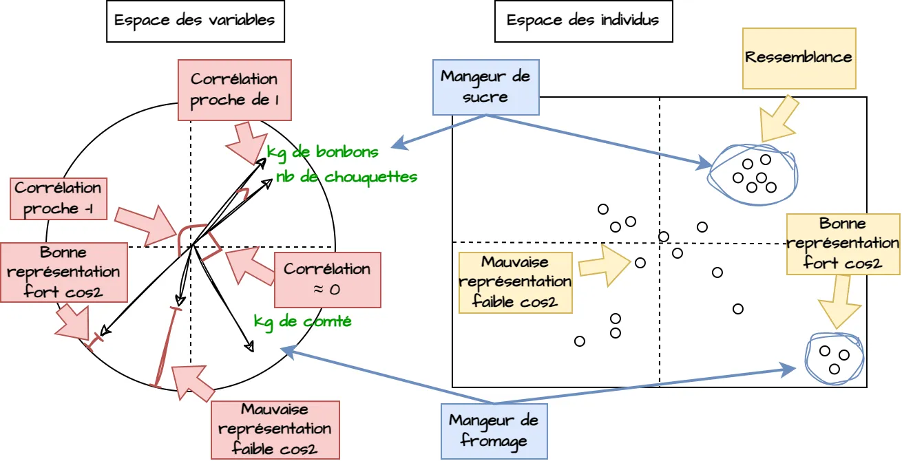{style="width: 100%"}

## ACP - Modalités dans le plan factoriel

::: panel-tabset

### Cercle des corrélations

```{r, echo=TRUE, collapse=FALSE}
fviz_pca_var(pca, col.var = "contrib", gradient.cols = c("#00AFBB", "#E7B800", "#FC4E07"), repel = TRUE)
```

### Interprétation

[Les variables bien représentées sur les axes 1 et 2 sont celles des valeurs propres. Nous avons les géométries des cours d'eau qui sont aussi fortement corrélées positivement entre elles (profondeur, rayon, largeur, surface), les indicateurs de la granulométrie sont aussi fortement corrélés positivement entre eux. Nous n'observons pas de corrélation entre ces deux groupes. Les indicateurs d'énergie des cours d'eau sont moins bien représentés et sont plutôt proches des indicateurs de la granulométrie à l'exception de la cote de ligne d'énergie.]{style="font-size: 0.7em;"}

:::

## ACP - Les individus dans le plan factoriel

::: panel-tabset

### Répartitions des individus

```{r, echo=TRUE, collapse=FALSE, fig.height=4}
fviz_pca_ind(pca, geom.ind = "point",
             alpha.ind = 0.3) # densité de points superposées
```

### Interprétation

Nous n'observons pas de groupes de stations bien identifiés sur les axes 1 et 2. Les stations sont réparties de manière homogène dans l'espace des individus.

:::

## ACP Explor

Des variables et/ou individus supplémentaires, non pris en compte dans les calculs, peuvent être ajoutés pour l'interprétation.

```{r, echo=TRUE, collapse=FALSE}
pca <- PCA(as.data.frame(carhyce_stat), 
           quanti.sup = 1, # surface_bv_km2
           quali.sup = c(2,3,4,19), # ripisyle gauche et droite, montagne/plaine
           ncp = Inf, # number of dimensions
           scale.unit = TRUE, # reduce
           graph = FALSE) # not display graph
```
Visualisation avec explor (ouvre une application web) : 
```{r, echo=TRUE, eval=FALSE}
# package explor
explor(pca)
```
## ACP Explor - Graphique

::: panel-tabset

### Individus

```{r, echo=FALSE, collapse=FALSE, fig.align='center', fig.height=7}
res <- explor::prepare_results(pca)
explor::PCA_ind_plot(res, xax = 1, yax = 2, ind_sup = FALSE, lab_var = NULL,
    ind_lab_min_contrib = 0, col_var = "montagne_plaine", labels_size = 9, point_opacity = 0.5,
    opacity_var = NULL, point_size = 28, ellipses = TRUE, transitions = TRUE,
    labels_positions = NULL, xlim = c(-6.59, 8.54), ylim = c(-7.28, 7.86))
```


### Interprétation

[L'ajout de la variable qualitative montagne_plaine permet d'identifier deux profils de stations. Au regard du cercle des corrélations, les stations de montagne on tendance à avoir une granulométrie plus grossière et probablement une énergie plus forte (vitesse, force tractrice, nombre de froude) que les stations de plaine. Les deux groupes ne sont cependant pas clairement distincts. Les variables de géométrie ou le débit ne permet pas clairement d'expliquer ces différences.]{style="font-size: 0.7em;"}

:::

# Classification

## Classification supervisée vs non supervisée {.smaller}

- **Supervisée** : on connait les classes à l'avance, on cherche à prédire la classe d'un nouvel individu à partir de différentes variables => classification ou catégorisation.
  - Exemple : on a une image satellite et on cherche à identifier les zones urbaines sur la base des valeurs des pixels. On identifie des zones urbaines et non urbaines pour entrainer le modèle. On se sert du modèle pour prédire les zones urbaines sur une nouvelle image.
  - Méthodes : régression logistique, SVM, arbres de décision, random forest
- **Non supervisée** : on ne connait pas les classes à l'avance, on cherche à regrouper les individus en fonction de leurs ressemblances => regroupement ou clustering.
  - Exemple : à partir d'une image satellite, on cherche à regrouper les pixels en fonction de leurs valeurs et identifier des zones homogènes que l'on suppose correspondre à de même occupation du sol.
  - Méthodes : K-means, CAH

## Classification ascendante hiérarchique (CAH) {.smaller}

- Une méthode non supervisée qui permet de regrouper des individus en fonction de leurs ressemblances.
- On cherche à ce que les individus regroupés au sein d’une même classe (inertie intra-classe) soient le plus semblables possibles tandis que les classes soient le plus dissemblables (inertie inter-classe) => on souhaite à minimiser la variance intra-classe et maximiser la variance inter-classe.
- La ressemblance ou la dissemblance entre les individus est mesurée à l'aide d'une matrice de distances entre chaque individu pris deux à deux. Plus la distance est faible, plus les individus sont semblables.
- La CAH part des individus (ascendante) et les regroupe progressivement en classes de plus en plus grandes (hiérarchique) => dendrogramme.

::: aside
Voir [le guide de Joseph Larmarange IRD, 2024](https://larmarange.github.io/guide-R/analyses_avancees/classification-ascendante-hierarchique.html){target="_blank"} ou [Analyse-R](https://larmarange.github.io/analyse-R/classification-ascendante-hierarchique.html){target="_blank"}
:::

## Inertie ? {.smaller}

- Une mesure de la dispersion des individus dans un espace multidimensionnel :
  - L'inertie intra-classe est la distance des individus d'une même classe par rapport à son centre de gravité (rapporté au nombre d'individus).
  - L'inertie inter-classe est la distance entre les centres de gravité des différentes classes et le centre de gravité des classes (rapporté au nombre de classes).


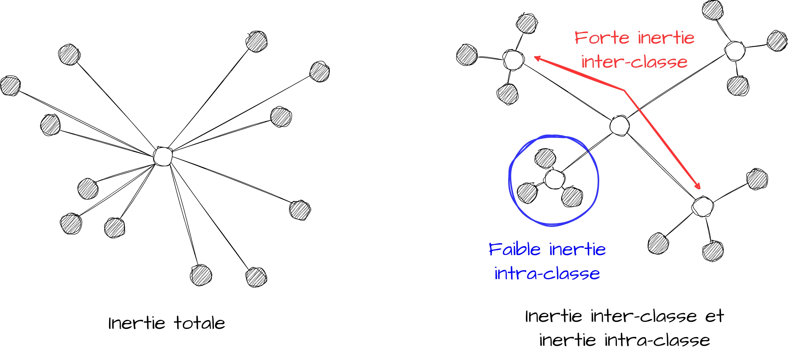{width="60%" fig-align="center"}

::: aside
Illustration modifiée de : Data Mining et Statistique décisionnelle (2017), Stéphane Tufféry, Editions Technip (p. 305)
:::

## Principes de la CAH

::: {.r-stack}

- On commence par considérer chaque individu comme une classe à part entière.
- On regroupe les deux individus les plus proches pour former une nouvelle classe.
- On répète l'opération jusqu'à ce que tous les individus soient regroupés dans une seule classe.
- On obtient un dendrogramme qui permet de visualiser les regroupements successifs.

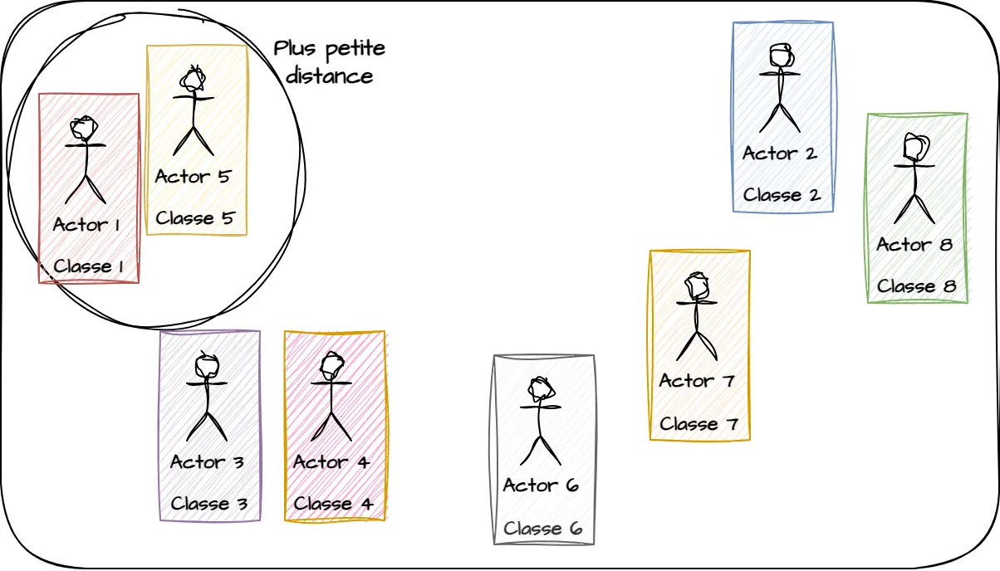{.fragment fragment-index="1" .fade-in-then-out style="position: absolute; top: 10%; left:0; width: 100%;"}
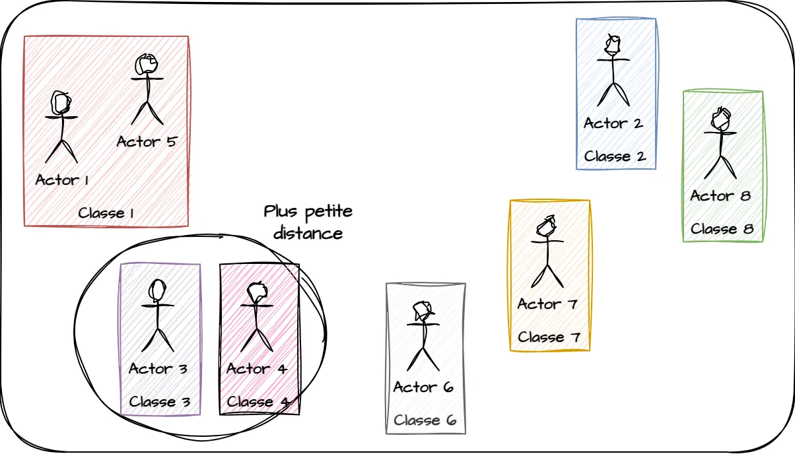{.fragment fragment-index="2" .fade-in-then-out style="position: absolute; top: 10%; left: 0; width: 100%;"}
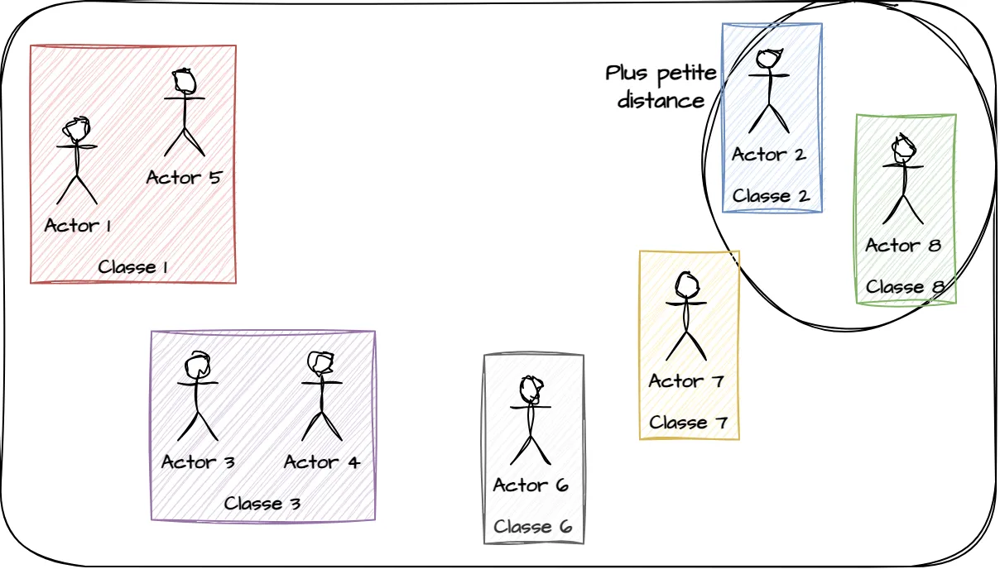{.fragment fragment-index="3" .fade-in-then-out style="position: absolute; top: 10%; left: 0; width: 100%;"}
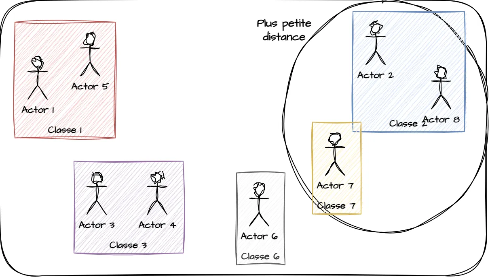{.fragment fragment-index="4" .fade-in-then-out style="position: absolute; top: 10%; left: 0; width: 100%;"}
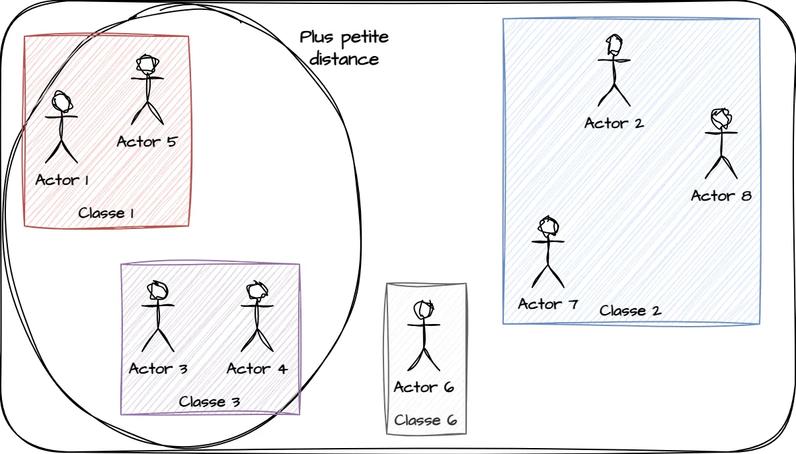{.fragment fragment-index="5" .fade-in-then-out style="position: absolute; top: 10%; left: 0; width: 100%;"}
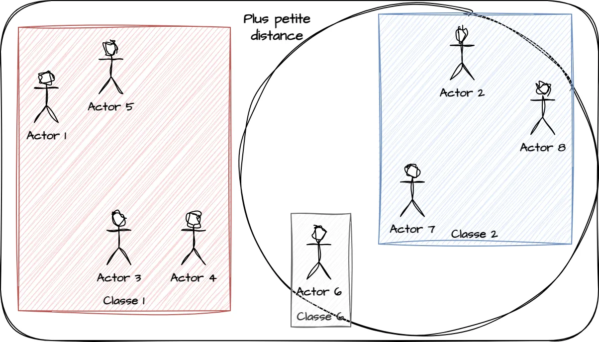{.fragment fragment-index="6" .fade-in-then-out style="position: absolute; top: 10%; left: 0; width: 100%;"}
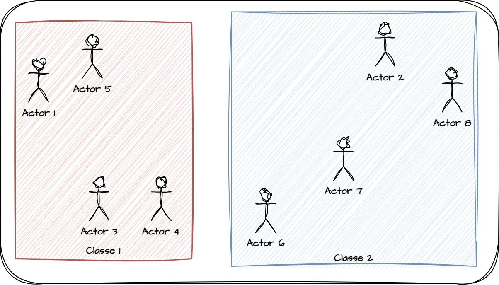{.fragment fragment-index="7" .fade-in-then-out style="position: absolute; top: 10%; left: 0; width: 100%;"}
{.fragment fragment-index="8" .fade-in-then-out style="position: absolute; top: 10%; left: 0; width: 100%;"}
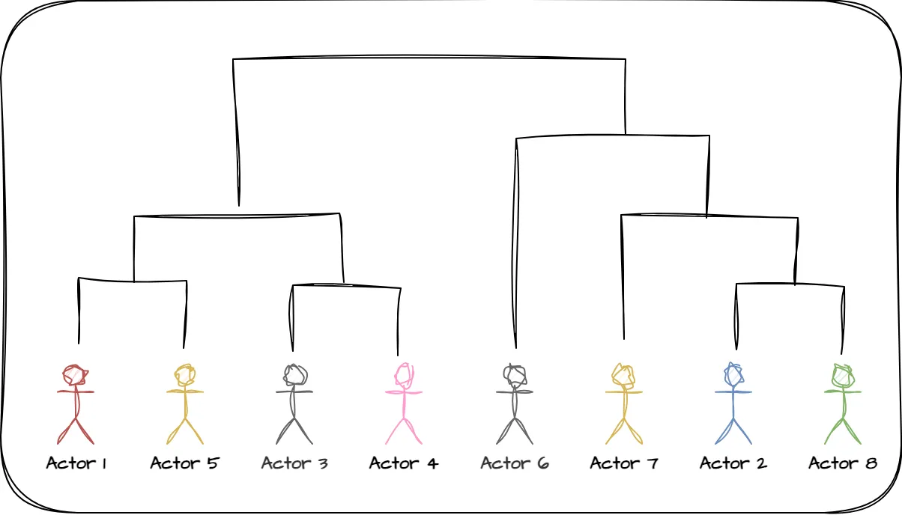{.fragment fragment-index="9" .fade-in-then-out style="position: absolute; top: 10%; left: 0; width: 100%;"}
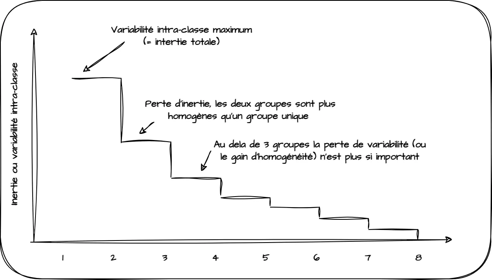{.fragment fragment-index="10" .fade-in-then-out style="position: absolute; top: 10%; left: 0; width: 100%;"}
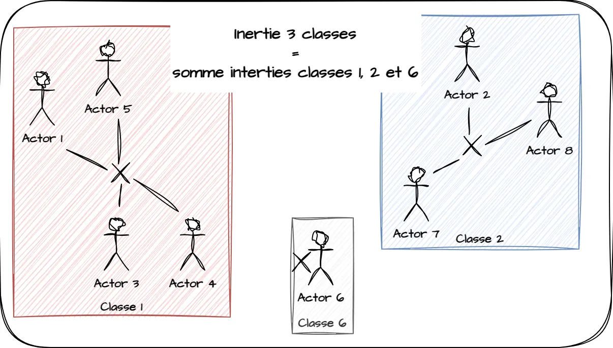{.fragment fragment-index="11" .fade-in-then-out style="position: absolute; top: 10%; left: 0; width: 100%;"}
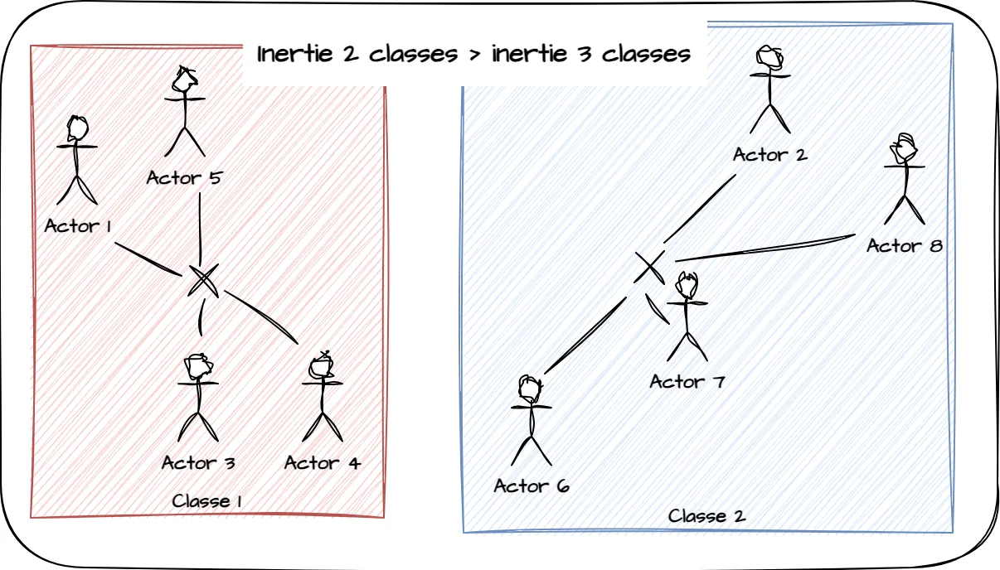{.fragment fragment-index="12" .fade-in-then-out style="position: absolute; top: 10%; left: 0; width: 100%;"}
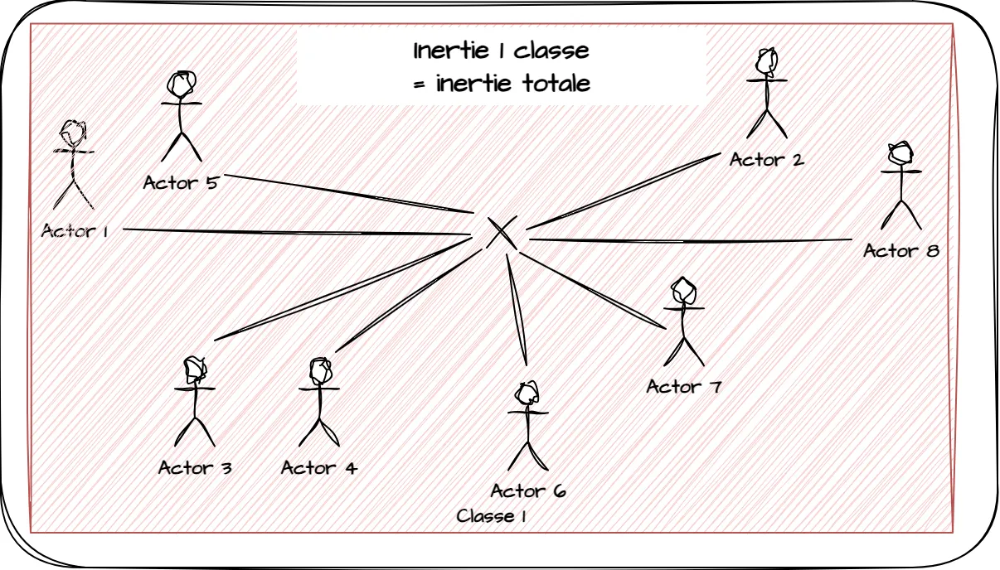{.fragment fragment-index="13" .fade-in-then-out style="position: absolute; top: 10%; left: 0; width: 100%;"}

:::


## Reprenons nos données {.smaller}

```{r, echo=TRUE, collapse=FALSE}
carhyce_stat <- carhyce %>% 
  # select the last date for each station
  group_by(code_station) %>% # group by station
  filter(date_realisation == max(date_realisation)) %>% # select the last date by group
  ungroup() %>%  # ungroup data
  # remove duplicated code_station
  filter(!duplicated(code_station)) %>% # remove duplicated code_station %>% 
  mutate(surface_bv_km2 = ifelse(surface_bv_km2 %in% boxplot.stats(surface_bv_km2)$out, NA, surface_bv_km2),
         score_ripisylve = ifelse(score_ripisylve %in% boxplot.stats(score_ripisylve)$out, NA, score_ripisylve),
         profondeur_moyenne_qb_m = ifelse(profondeur_moyenne_qb_m %in% boxplot.stats(profondeur_moyenne_qb_m)$out, NA, profondeur_moyenne_qb_m),
         largeur_mouillee_qb_m = ifelse(largeur_mouillee_qb_m %in% boxplot.stats(largeur_mouillee_qb_m)$out, NA, largeur_mouillee_qb_m),
         surface_mouillee_qb_m2 = ifelse(surface_mouillee_qb_m2 %in% boxplot.stats(surface_mouillee_qb_m2)$out, NA, surface_mouillee_qb_m2),
         rayon_hydraulique_qb = ifelse(rayon_hydraulique_qb %in% boxplot.stats(rayon_hydraulique_qb)$out, NA, rayon_hydraulique_qb),
         d16_mm = ifelse(d16_mm %in% boxplot.stats(d16_mm)$out, NA, d16_mm),
         d50_mm = ifelse(d50_mm %in% boxplot.stats(d50_mm)$out, NA, d50_mm),
         d84_mm = ifelse(d84_mm %in% boxplot.stats(d84_mm)$out, NA, d84_mm),
         coefficient_de_sinuosite = ifelse(coefficient_de_sinuosite %in% boxplot.stats(coefficient_de_sinuosite)$out, NA, coefficient_de_sinuosite),
         coefficient_rugosite = ifelse(coefficient_rugosite %in% boxplot.stats(coefficient_rugosite)$out, NA, coefficient_rugosite),
         debit_plein_bord_m3_s = ifelse(debit_plein_bord_m3_s %in% boxplot.stats(debit_plein_bord_m3_s)$out, NA, debit_plein_bord_m3_s),
         vitesse_moyenne_qb_m_s = ifelse(vitesse_moyenne_qb_m_s %in% boxplot.stats(vitesse_moyenne_qb_m_s)$out, NA, vitesse_moyenne_qb_m_s),
         cote_ligne_energie_qb = ifelse(cote_ligne_energie_qb %in% boxplot.stats(cote_ligne_energie_qb)$out, NA, cote_ligne_energie_qb),
         nombre_de_froude_qb = ifelse(nombre_de_froude_qb %in% boxplot.stats(nombre_de_froude_qb)$out, NA, nombre_de_froude_qb),
         force_tractrice_qb_n_m2 = ifelse(force_tractrice_qb_n_m2 %in% boxplot.stats(force_tractrice_qb_n_m2)$out, NA, force_tractrice_qb_n_m2)) %>% # replace outliers by NA by Interquartile range (IQR) from boxplot function
  mutate(montagne_plaine = ifelse(modele_reference_img %in% c("ALPES INTERNES", "CEVENNES", "CORSE", "JURA-PREALPES DU NORD", "MASSIF CENTRAL NORD", "MASSIF CENTRAL SUD", "Montagne volcanique des DOM", "PREALPES DU SUD", "PYRENEES"), "montagne", "plaine")) %>% # try to classify in two category, montagne and plaine
  # select columns
  select(surface_bv_km2,
         profondeur_moyenne_qb_m,
         largeur_mouillee_qb_m,
         surface_mouillee_qb_m2,
         rayon_hydraulique_qb,
         d16_mm,
         d50_mm,
         d84_mm,
         debit_plein_bord_m3_s,
         vitesse_moyenne_qb_m_s,
         cote_ligne_energie_qb,
         nombre_de_froude_qb,
         force_tractrice_qb_n_m2, 
         code_station) %>%  # select columns
  column_to_rownames(var = "code_station") %>% # set code_station as rownames
  na.omit() # remove NA
```

## Standardisation des données

- Homogénéisation des données pour éviter les effets d'échelle (unités différentes) et que les variables à forte variance soit prépondérante dans les résultats.

Transformation par l'étendue (cf. diapo standardisation)

```{r, echo=TRUE, collapse=FALSE}
normalize_MC <- function(x) {
  return ((x - min(x, na.rm = TRUE)) / (max(x, na.rm = TRUE) - min(x, na.rm = TRUE)))
}
# normalize data
carhyce_stat_mc<-as.data.frame(lapply(carhyce_stat, normalize_MC))
```

\

Transformation z-score (centrage-réduction)
```{r, echo=TRUE, collapse=FALSE}
# z-score transformation
carhyce_stat_z <- scale(carhyce_stat, center = TRUE, scale = TRUE)
```

## La matrice de distance

- Plusieurs méthode de calcul de distance entre les individus : 
  - **Variables quantitatives** :
    - Euclidienne : adaptée aux données continues, sensible aux valeurs extrêmes, cluster "sphérique".
    - Manhattan : adaptée aux données discrètes, moins sensible aux valeurs extrêmes, cluster "rectangulaire".  
  - **Variables qualitatives** : $\phi^2$
  - **Variables quantitatives et qualitatives** : distance de Gower

```{r, echo=TRUE, collapse=FALSE}
# Euclidean distance
dist_euclid <- dist(carhyce_stat_mc, method = "euclidean")
```

## Méthode d'agrégation {.smaller}

::: columns
::: {.column width="50%"}

Comment regrouper des classes entres elles ou calculer la distance entre deux classes ?

- **Saut maximum (ou complete linkage)** : distance maximum entre deux individus de deux classes. Tend à créer des classes de diamètre équivalent, sensible aux individus hors normes.

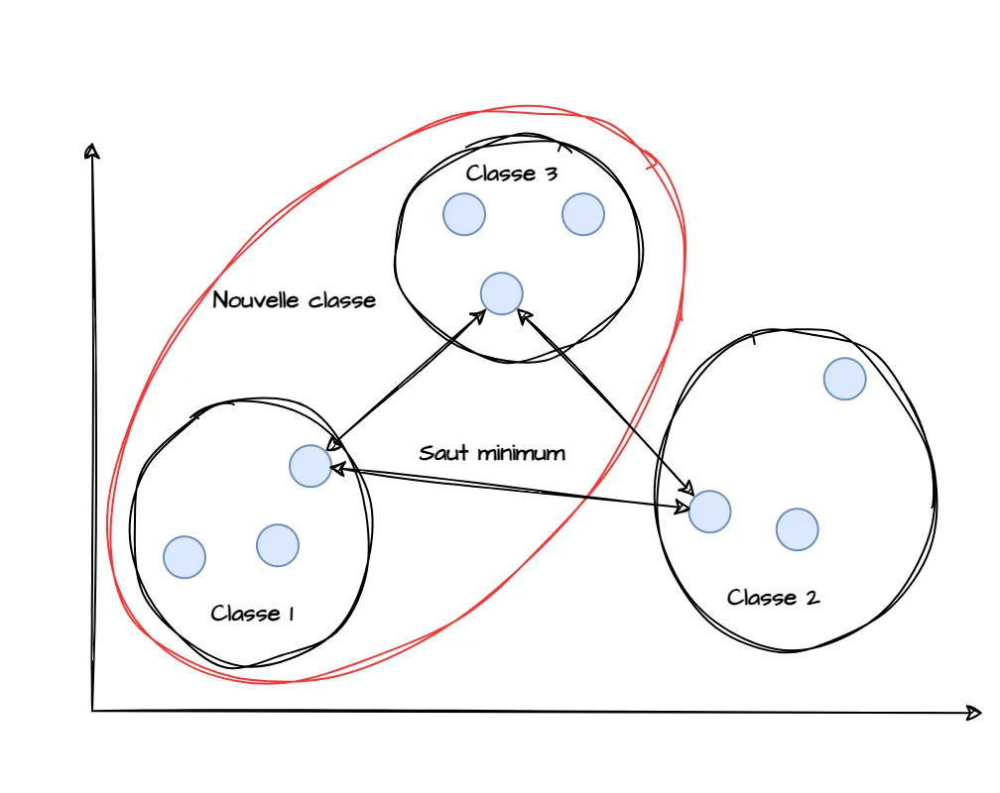{width="100%"}

::: 
::: {.column width="50%"}

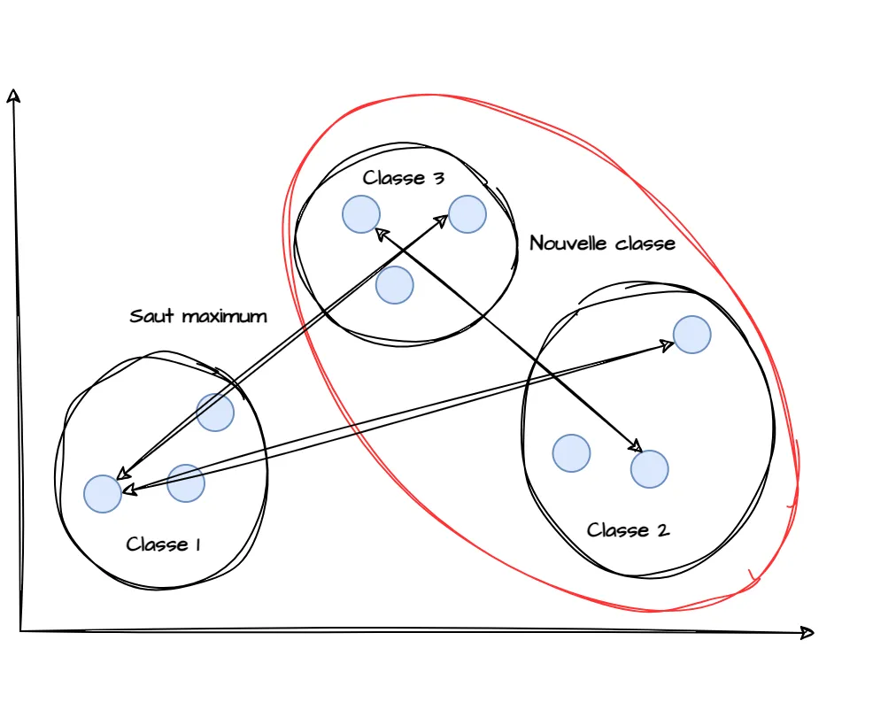{width="100%"}

- **Saut minimum (ou single linkage)** : distance minimum entre deux individus de deux classes. Permet de traiter des formes allongées mais peut avoir des effets de chaîne et regrouper deux classes éloignées reliées par une chaîne d'individus.

:::
:::

## Méthode d'agrégation (suite) {.smaller}

::: columns
::: {.column width="50%"}

- **Distance moyenne (ou average linkage)** : moyenne des distances entre tous les individus de deux classes. Moins sensible aux bruits, tend à créer des classes de même variance.

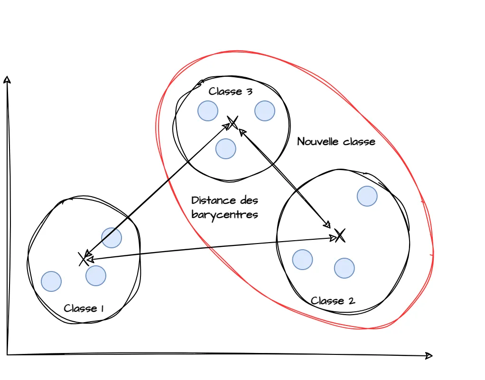{width="100%"}

:::
::: {.column width="50%"}

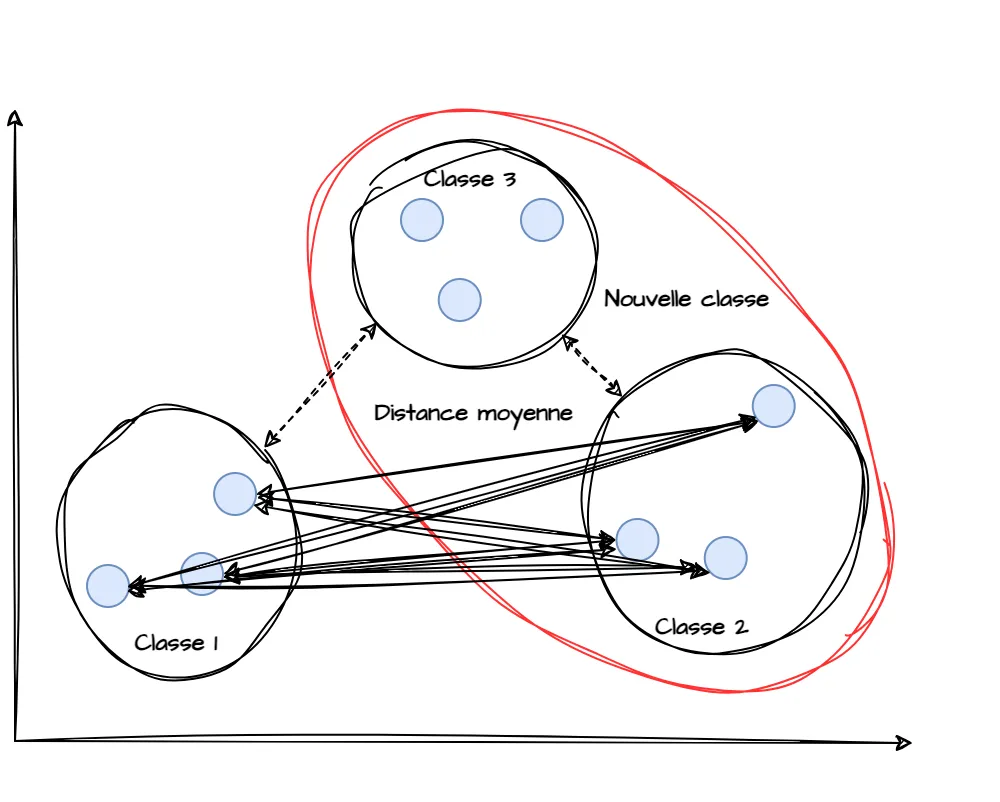{width="100%"}

- **Distance des barycentre (ou centroid linkage)** : distance entre les barycentres des deux classes. Peu sensible au bruit mais moins précise.

:::
:::

## Méthode d'agrégation (suite et fin) {.smaller}

::: columns
::: {.column width="50%"}

 - **Distance de Ward** : minimise l'inertie intra-classe ou  maximise l'intertie inter-classe. Une méthode généralement la meilleure pour des données quantitatives continues, peu sensible aux bruits et aux valeurs extrêmes, tend à créer des classes sphériques et de même effectifs.

:::
::: {.column width="50%"}

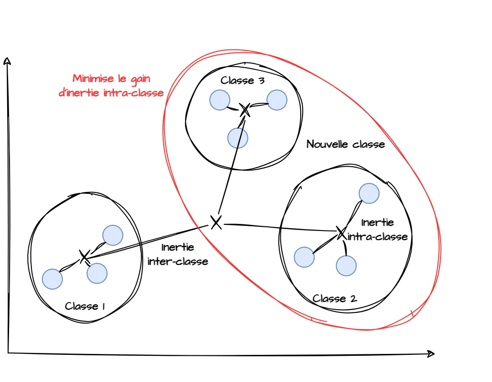{width="100%"}

:::
:::
 
::: aside
 Pour aller plus loin, voir Data Mining et Statistique décisionnelle (2017), Stéphane Tufféry, Editions Technip et l'article Hierarchical Clustering de Fatih Karabiber sur [https://www.learndatasci.com](https://www.learndatasci.com/glossary/hierarchical-clustering/){target="_blank"}
:::

## Agrégation et dendrogramme
  
```{r, echo=TRUE, collapse=FALSE, fig.align='center'}
# Ward method
hc <- hclust(dist_euclid, method = "ward.D2")

# Dendrogram
plot(hc, hang = -1, cex = 0.6, main = "Dendrogramme CAH", label=FALSE)
```


## Nombre de classes - Inertie

Intertie => intertie intra-classe (dispersion des individus au sein d'une même classe)

```{r, echo=TRUE, collapse=FALSE, fig.align='center'}
v <- sort(hc$height,decreasing=T)
plot(1:length(v),v,type = "s", xlab = "Nombre de classes", ylab = "Inertie", 
     xlim = c(0, 30), xaxt = "n")
axis(1, at = seq(1, 30, by = 1), las=2)
```

## Découper les classes

```{r, echo=TRUE, collapse=FALSE, fig.align='center'}
plot(hc, labels = FALSE, main = "Partition en 2, 5 ou 7 classes", xlab = "", ylab = "", 
     sub = "", axes = FALSE, hang = -1)
rect.hclust(hc, 2, border = "green3")
rect.hclust(hc, 4, border = "red3")
rect.hclust(hc, 7, border = "blue3")
```

```{r, echo=TRUE, collapse=FALSE}
# cut dendrograme in 4 classes
hc_gp <- cutree(hc,k=4)
```

## Interprétation CAH

- Quelles sont les distributions des variables dans chaque classe ?
- Quelles sont les caractéristiques des individus dans chaque classe ?
- Quelles sont les caractéristiques des classes ?

```{r, echo=TRUE, collapse=FALSE, fig.align='center', eval=FALSE}
# box plot each class for each variable
carhyce_stat$group <- as.factor(hc_gp)
carhyce_stat %>%
  gather(key = "variable", value = "value", -group) %>%
  ggplot(aes(x = group, y = value, fill = group)) +
  geom_boxplot() +
  facet_wrap(~variable, scales = "free_y") +
  theme_minimal() +
  theme(axis.text.x = element_text(angle = 45, hjust = 1))
```

## Interprétation CAH - boxplot variables

```{r, echo=FALSE, collapse=FALSE, fig.align='center'}
# box plot each class for each variable
carhyce_stat$group <- as.factor(hc_gp)
carhyce_stat %>%
  gather(key = "variable", value = "value", -group) %>%
  ggplot(aes(x = group, y = value, fill = group)) +
  geom_boxplot() +
  facet_wrap(~variable, scales = "free_y") +
  theme_minimal() +
  theme(axis.text.x = element_text(angle = 45, hjust = 1))
```

## Répartition spatiale des classes - Code

```{r, echo=TRUE, collapse=FALSE, warning=FALSE, message=FALSE, eval=FALSE}
tmap_mode(mode = "view") # set tmap mode to interactive
carhyce_stat_sf <- carhyce_stat %>% 
  rownames_to_column(var = "code_station") %>% 
  mutate(code_station = as.integer(code_station)) %>%
  # add x and y columns from carhyce from code_station and rownames
  left_join(carhyce %>% select(code_station, x, y), by = c("code_station" = "code_station")) %>% 
  st_as_sf(coords = c("x", "y")) # convert to sf object
st_crs(carhyce_stat_sf) <- 2154 # set projection
tm_shape(carhyce_stat_sf) + # tmap object
  tm_dots(col = "group", size = 1, palette = "Set1") + # plot points
  tm_layout(legend.position = c("right", "top")) # legend position
```

## Répartition spatiale des classes - Code

```{r, echo=FALSE, collapse=FALSE, fig.align='center', warning=FALSE, message=FALSE, fig.height=6, fig.width=12}
tmap_mode(mode = "view") # set tmap mode to interactive
carhyce_stat_sf <- carhyce_stat %>% 
  rownames_to_column(var = "code_station") %>% 
  mutate(code_station = as.integer(code_station)) %>%
  # add x and y columns from carhyce from code_station and rownames
  left_join(carhyce %>% select(code_station, x, y), by = c("code_station" = "code_station")) %>% 
  st_as_sf(coords = c("x", "y")) # convert to sf object
st_crs(carhyce_stat_sf) <- 2154 # set projection
tm_shape(carhyce_stat_sf) + # tmap object
  tm_dots(col = "group", size = 1, palette = "Set1") + # plot points
  tm_layout(legend.position = c("right", "top")) # legend position
```

## Interprétation CAH - boxplot classes

```{r, echo=TRUE, collapse=FALSE, fig.align='center', fig.width=15}
# variables boxplots for class 2 only
carhyce_stat %>%
  filter(group == 2) %>%
  gather(key = "variable", value = "value", -group) %>%
  ggplot(aes(x = variable, y = value, fill = variable)) +
  geom_boxplot() + theme_minimal() + 
  theme(axis.text.x = element_text(angle = 45, hjust = 1))
```


## Interprétation CAH - ACP

```{r, echo=TRUE, collapse=FALSE}
# PCA
pca <- PCA(carhyce_stat, ncp = Inf, scale.unit = TRUE, graph = FALSE,
            quali.sup = 14) # illustrative group variable
# explor(pca)
```

```{r, echo=FALSE, collapse=FALSE, fig.align='center', fig.height=7}
res <- explor::prepare_results(pca)
explor::PCA_ind_plot(res, xax = 1, yax = 2, ind_sup = FALSE, lab_var = NULL,
    ind_lab_min_contrib = 0, col_var = "group", labels_size = 9, point_opacity = 0.5,
    opacity_var = NULL, point_size = 64, ellipses = TRUE, transitions = TRUE,
    labels_positions = NULL, xlim = c(-6.76, 11.9), ylim = c(-8.72, 9.95))
```

# Un peu de détails

## Régression linaire géométrique vs mathématique {.smaller}

- Une régression polynomiale n'est pas une droite mais reste une relation linéaire au sens mathématique.

Equation d'une relation linéaire : $y=\beta_0+\beta_1x$. Le coefficient (pente) $\beta_1$ est linéaire, $\beta_1^2$ aurait été non linaire.

\

Equation polynomiale de degré 2 : $y=\beta_0+\beta_1x+\beta_2x2$. Les coefficients $\beta_1$ et $\beta_2$ sont aussi linéaire. La régression est donc mathématiquement linéaire même si ce n'est pas une droite.

\

Le constat est le même pour une régression logarithmique : $y=\beta_0+\beta_1ln(x)$. Mais pas pour une régression exponentielle : $y=\beta_0e^{\beta_1x}$ car $\beta_1$ est dans une exponentielle. 

## Test de la pente d'une régression linéaire (graphique)

::: columns
::: {.column width=70%}

- Hypothèse nulle $H_0$ : la pente est égale à 0 (pas de relation linéaire entre les deux variables)
- Hypothèse alternative $H_1$ : la pente est différente de 0 (relation linéaire entre les deux variables)
- Test de Student :
$t = \frac{\beta_1 - 0}{S(b_1)}$ où $b_1$ est la pente estimée et $S(\beta_1)$ son écart-type.
- Le test suit une loi de Student à $n-2$ degrés de liberté.

:::
::: {.column width=30%}

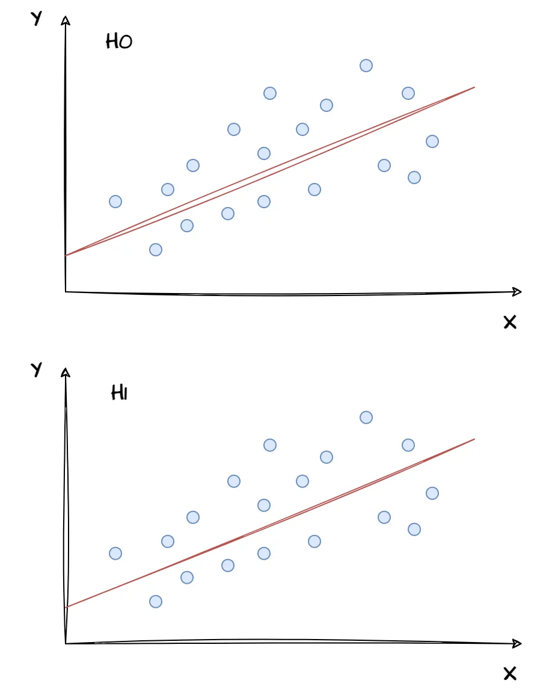{width="100%"}
:::
:::

## Explication du coefficient de détermination {.smaller}

::: columns
::: {.column width=50%}

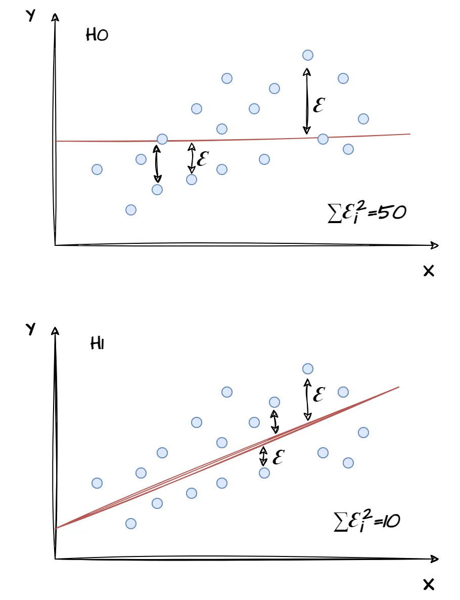{width="50%"}


:::
::: {.column width=50%}

| Dispersion | Somme des carrés des écarts | Part de la dispersion |
|------------|-----------------------------|-----------------------|
| Régression | 40                          | 80% = $R^2$           |
| Résiduelle | 10                          | 20%                   |
| Total      | 50                          | 100%                  |


Sur la dispersion total, 20% est celle des résidus de la régression, et donc 80% de la dispersion peut être expliquée par le modèle. $R^2$ représente la part de la dispersion totale expliqué par la régression ajustée.

:::
:::

::: aside
[Explication reprise de la vidéo de Tierry Ancelle](https://www.youtube.com/watch?v=XL3ZOuFxW4g){target="_blank"}
:::

## Les degrés de liberté {.smaller}

- Les degrés de liberté sont le nombre de valeurs susceptible de varier dans un calcul statistique. Les observations d'un échantillon peuvent varier d'un échantillon à l'autre, reflétant la variabilité inhérente des données dans la population. 

- Pour une série de 5 valeurs de moyenne 10 les 4 premières valeurs sont libres mais la cinquième devra systématiquement le nombre qui fera en sorte que la moyenne soit 10.

```{r}
df <- data.frame(
  x1 = 3,
  x2 = 7,
  x3 = 14,
  x4 = 12,
  x5 = NA,
  moyenne = 10,
  row.names = "Valeurs"
)
df
```

\

- La dernière valeur ne peut être que 14 pour avoir notre moyenne de 10. 

- Nous avons 4 degrés de liberté.

::: aside
Je vous conseille le visionnage de la [vidéo de Thierry Ancelle sur le sujet](https://www.youtube.com/watch?v=2n3L4yPrn2Q&t=389s) dont j'ai repris cette explication et la suivante sur les tableaux de contingence
:::

## Les degrés de liberté - tableau de contingence {.smaller}

::: columns
::: {.column width=50%}

- Lors d'une test du Khi2 sur un tableau de contingence nous cherchons les effectifs attendus si les deux variables qualitatives sont indépendantes mais en respectant les effectifs marginaux en lignes en colonnes.

- Le nombre de degrés de liberté est le nombre de valeurs qui peuvent varier librement dans le calcul des effectifs attendus. Des valeurs peuvent variées puis le reste des effectifs est sous contrainte des totaux, comme une grille de Sudoku.

:::
::: {.column width=50%}

\

<div class="overlay">

::: {.fragment .fade-out}

```{r, echo=FALSE, collapse=FALSE}
tab <- data.frame(
  A = c(NA, NA, NA, 12),
  B = c(NA, NA, NA, 85),
  Totaux = c(52, 23, 22, 97)
)
rownames(tab) <- c("X", "Y", "Z", "Totaux")
tab

```

:::

::: {.fragment .fade-in-then-out}

```{r, echo=FALSE, collapse=FALSE}
tab <- data.frame(
  A = c(6, NA, NA, 12),
  B = c(NA, NA, NA, 85),
  Totaux = c(52, 23, 22, 97)
)
rownames(tab) <- c("X", "Y", "Z", "Totaux")
tab

```

:::

::: {.fragment .fade-in-then-out}

```{r, echo=FALSE, collapse=FALSE}
tab <- data.frame(
  A = c(6, NA, NA, 12),
  B = c(NA, NA, 20, 85),
  Totaux = c(52, 23, 22, 97)
)
rownames(tab) <- c("X", "Y", "Z", "Totaux")
tab

```

:::

::: {.fragment}

```{r, echo=FALSE, collapse=FALSE}
tab <- data.frame(
  A = c(6, 4, 2, 12),
  B = c(46, 19, 20, 85),
  Totaux = c(52, 23, 22, 97)
)
rownames(tab) <- c("X", "Y", "Z", "Totaux")
tab

```

- Seulement deux cases peuvent varier librement, les autres sont sous contraintes. Nous avons donc 2 degrés de liberté.

:::

</div>

:::
:::


## La standardisation z-score {.smaller}

\

- La standardisation z-score est une technique de transformation des données qui consiste à centrer et réduire les variables $x' = \frac{x - \bar{x}}{s}$ :
  - Centrage : soustraire la moyenne de chaque variable à chaque observation.
  - Réduction : diviser par l'écart-type de chaque variable.

- On obtient des variables centrées-réduites, qui ont une moyenne nulle et une variance égale à 1.

- La standardisation est particulièrement utile lorsque les variables sont mesurées sur des échelles différentes ou ont des unités différentes. Elle permet de comparer les variables entre elles et d'éviter que les variables à forte variance ne dominent les résultats des analyses statistiques.

## La standardisation z-score - Exemple {.smaller}

- J'ai des choux dont le poids moyen est de 500g avec un écart-type de 100g et des carottes dont la taille moyenne est de 30cm avec un écart-type de 5cm.

- Je prends un choux de 600g et une carotte de 40cm. Je veux les comparer... est-ce que c'est plus improbable d'avoir un choux de 600g ou une carotte de 40cm ? 🤔

- Je centre mes choux et mes carottes : mon choux est plus lourd de 100g que la moyenne des choux, ma carottes est plus grande de 10cm que la moyenne des carottes.
Si je réduis en divisant par leur écart-type. L'écart-type devient mon unité de référence, une valeur de 1,7 signifie que ma valeur a 1,7 écart-type (mais sans unité). 

- Mon choux a alors une valeur de 1 écart-type et ma carotte une valeur de 2 écart-types. Ma carotte de 40cm est alors bien plus improbable (<5% de probabilité) à avoir que mon choux de 600g. Nous avons donc pu comparer une variable de poids et une variable de distance malgré la différence d'unité et d'ordre de grandeur.

::: aside
ℹ️ Cette analogie a été inspirée d'un cours de Jérôme Pagès (Math Agrocampus Ouest), [disponible en ligne et à visionner pour une explication plus détaillée](https://www.youtube.com/watch?v=JNHwdqwgXkc){target="_blank"}
:::

## Autres méthodes de standardisation {.smaller}

\

- Les autres méthodes de standardisation ont toutes pour objectifs de pourvoir comparer des variables différentes en évitant les effets d'échelle.
- Comme autre méthodes, on peut citer :
  - La division des valeurs par la valeur maximale de la variable, $x' = \frac{x}{\text{max}(x)}$.
  - La division des valeurs par la somme des observations, $x' = \frac{x}{\sum x}$.
  - La standardisation par l'étendue avec $x' = \frac{x - \text{min}(x)}{\text{max}(x) - \text{min}(x)}$ ou $x' = \frac{x}{\text{max}(x) - \text{min}(x)}$
  
Milligan & Cooper[^6] dans le contexte de classification hiérarchique mettent en avant les standardisations par l'étendue dans la séparation de cluster, meilleure que le z-score.

[^6]: Milligan, G.W., Cooper, M.C. A study of standardization of variables in cluster analysis. Journal of Classification 5, 181–204 (1988). [https://doi.org/10.1007/BF01897163](https://doi.org/10.1007/BF01897163)

## Distance euclidienne vs distance de Manhattan {.smaller}

::: columns
::: {.column width=60%}

- **Distance euclidienne** : la distance "à vol d'oiseau" entre deux points dans un espace multidimensionnel. C'est la racine carrée de la somme des carrés des différences entre les coordonnées des deux points.
  - Formule : $d(p, q) = \sqrt{\sum_{i=1}^{n} (p_i - q_i)^2}$
- **Distance de Manhattan** : la distance totale parcourue pour aller d'un point à un autre en suivant un chemin en forme de grille (comme les rues d'une ville). C'est la somme des valeurs absolues des différences entre les coordonnées des deux points.
  - Formule : $d(p, q) = \sum_{i=1}^{n} |p_i - q_i|$
  
:::
::: {.column width=40%}

\

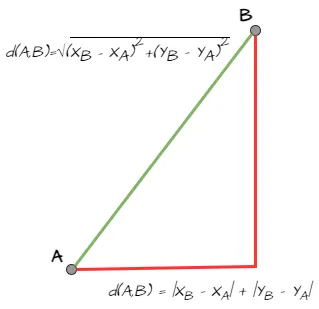{width="70%" fig-align="center"}

:::
:::

## Distance de Gower {.smaller}

- Utilisée pour des données mixtes (quantitatives, qualitatives et binaires).
- La distance de Gower varie entre 0 (individus identiques) et 1 (totalement différents).  Il se calcul à partir de l'indice de similarité de Gower[^7] $S_g$ : $D_g=1-S_g$ avec $S_g(i,j)=\frac{\sum_{k=1}^{p} w_k \, \delta_{ij}^{(k)} \, s_{ij}^{(k)}}{\sum_{k=1}^{p} w_k \, \delta_{ij}^{(k)}}$ où :

  - $p$ : le nombre total de variables,
  - $w_k$ : le poids attribué à la variable k (souvent égal à 1),
  - $\delta_{ij}^{(k)}$ : un indicateur de validité qui vaut 1 si les deux individus i et j ont des valeurs non manquantes pour la variable k, sinon  0,
  - $s_{ij}^{(k)}$ est la mesure de similarité pour la variable k entre les individus i et j

- En version simplifiée sans $w_k$ et $\delta_{ij}^{(k)}$ : $D_g(i,j)=1-(\frac{\sum_{k=1}^{p}s_{ij}^{k}}{p})$

[^7]: Gower, J. C. (1971). A general coefficient of similarity and some of its properties. Biometrics, 27(4), 857-871. [https://doi.org/10.2307/2528823](https://doi.org/10.2307/2528823)
  
## Indice de similarité de Gower 

- La mesure de similarité $s_{ij}^{(k)}$ dépend donc du type de variable :
    - Pour une variable quantitative : $s_{ij}^{(k)} = 1 - \frac{|x_{ik} - x_{jk}|}{\text{max}_k - \text{min}_k}$
    - Pour une variable qualitative : $s_{ij}^{(k)} = 1$ si $x_{ik} = x_{jk}$, sinon $s_{ij}^{(k)} = 0$
    - Pour une variable binaire (e.g. TRUE/FALSE), la variable peut être traitée comme symétrique et la similarité est calculée comme une variable qualitative, elle peut être traitée comme une variable assymétrique et la modalité jointe absence/absence (ou FALSE/FALSE) du calcul est ignorée.

## Distance de Gower - Exemple {.smaller}

::: columns
::: {.column width=50%}

```{r, echo=TRUE, collapse=FALSE}
df <- data.frame(
  Taille = c(160, 170, 165),
  Couleur = as.factor(c("Rouge", "Bleu", "Rouge")),
  Plumes = as.factor(c(FALSE, TRUE, FALSE)) # binary variable to symetric variable
)
df
```

:::
::: {.column width=50%}

```{r, echo=TRUE, collapse=FALSE}
# Gower distance
gower_dist <- cluster::daisy(df, metric = "gower")
print(gower_dist)
# distance matrix
as.matrix(gower_dist)
```

:::
:::

- $D_g(1,2) = 1$ : Dissimilarité totale entre l'individu 1 et 2
- $D_g(1,3) = 0.17$ : Forte similarité entre l'individu 1 et 3
- $D_g(2,3) = 0.83$ : Forte dissimilarité entre l'individu 2 et 3

## Distance du Chi² - Les tontons {.smaller}

- Comment mesurer la dissimilarité entre plusieurs individus décrits par des variables qualitatives (catégorielles) ?

```{r, echo=TRUE, collapse=FALSE}
df <- data.frame(Sexe = c("H", "H", "H", "H", "H"),
                 Age = c("Âgé", "Jeune", "Âgé", "Âgé", "Jeune"),
                 Profession = c("Truand", "Étudiant", "Truand", "Truand", "Truand"),
                 row.names = c("Fernand", "Antoine", "Raoul", "Folace", "Jean"))
df[] <- lapply(df, factor) # convert to factor
df
```

## Distance du Chi² - Tableau disjonctif {.smaller}

- On code les variables qualitatives en indicatrices binaires (0/1) pour chaque modalité de chaque variable sous la forme d'un tableau disjonctif complet. Une forme de tableau de contingence binaire.

```{r, echo=TRUE, collapse=FALSE}
x <- FactoMineR::tab.disjonctif(df)
data.frame(x)
```

## Distance du Chi² - Les fréquences totales des modalités {.smaller}

::: columns
::: {.column width=60%}

- On souhaite mesurer la "distance", ou le degré de dissimilarité, entre Fernand et Antoine.

- La distance euclidienne n'est pas adaptée car elle ne prend pas en compte la fréquence des modalités dans l'ensemble des individus. En effet, plus un évènement est rare plus une petite différence est importante. Ce qui distingue surtout Antoine des autres tontons est qu'il est étudiant. Le $\chi^2$ pondère ainsi la distance par la fréquence des modalités.

- Nous avons 5 individus et 3 variables, donc 15 réponses au total. Avec le tableau précédent, on peut calculer la fréquence de chaque modalité sur la totalité des réponses. Exemple : 3 individus sont agés sur les 15 réponse, $3/15 = 0.2$. Les étudiants sont très rare avec 6.7% des réponses.

:::
::: {.column width=40%}

```{r, echo=TRUE, collapse=FALSE}
data.frame(freq = round(colSums(x)/15, 3))
```

:::
:::

## Distance du Chi² - Les fréquences partielles en lignes

- Il faut établir les profils de Fernand et Antoine, c'est-à-dire la proportion de chaque modalité dans l'ensemble des réponses pour chaque individu ou la fréquence partielle en ligne du tableau disjonctif complet (le total égal 1).

```{r, echo=TRUE, collapse=FALSE}
data.frame(
  rbind(round(x["Fernand", ] / 3, 3), round(x["Antoine", ] / 3, 3)),
  row.names = c("Fernand", "Antoine"))
```
## Distance du Chi² - Calcul {.smaller}

- La formule de la distance du Chi² entre deux individus i et j est définie comme :
$D^2_{\chi^2}(i,j) = \sum_{k=1}^{p} \frac{(x_{ik} - x_{jk})^2}{f_k}$ où :
  - $p$ : le nombre total de variables qualitatives,
  - $x_{ik}$ et $x_{jk}$ : proportion des individus i et j pour la modalité k,
  - $f_k$ : la fréquence total de la modalité k dans l'ensemble des individus.

- Pour Fernand et Antoine, nous avons :
$D^2_{\chi^2}(Fernand, Antoine) = \frac{(0.333 - 0.333)^2}{0.333} + \frac{(0.333 - 0)^2}{0.20} + \frac{(0 - 0.333)^2}{0.133} + \frac{(0 - 0.333)^2}{0.067} + \frac{(0.333 - 0)^2}{0.267}$

```{r, echo=TRUE, collapse=FALSE}
D2_chi2 <- ((0.333 - 0.333)^2 / 0.333) + ((0.333 - 0)^2 / 0.2) + 
  ((0 - 0.333)^2 / 0.133) + ((0 - 0.333)^2 / 0.067) + ((0.333 - 0)^2 / 0.267)
data.frame(D2_chi2 = round(D2_chi2, 2),
           D_chi2 = sqrt(D2_chi2),
           row.names = "Fernand vs Antoine")
```

## Distance du Chi² - Calcul R avec FactoMineR

```{r, echo=TRUE, collapse=FALSE}
library(FactoMineR)
res.ca <- CA(x, graph = FALSE)
coords <- res.ca$row$coord
D_ca <- as.matrix(dist(coords))
data.frame(round(D_ca, 3))
```

## Distance du Φ²

- La distance du Φ² reprend la distance du $\chi^2$ que l'on divise par le nombre d'individus. Ainsi $D_{\phi^2} = D_{\chi^2}/n$.

- Le $\chi^2$ est une quantité totale d'écart entre deux distribution, plus il y a d'observations plus il y a de potentiel d'écarts cumulés. Le Φ² normalise ou met à l'échelle permettant de comparer plusieurs tableaux ou sous-population comme pour des méthodes de classification (cf. CAH) pour ne pas donner plus de poids aux groupes plus grands. La distance du $\chi^2$ est privilégiée dans les analyses de correspondances (AFC, ACM).

# Eléments de calcul

## Paramètres de dispersion

- **Variance** => la moyenne des carrés des écarts à cette moyenne :

$s^2 = \frac{1}{n-1} \sum_{i=1}^{n} (x_i - \bar{x})^2$

- **Ecart-type** => la racine carrée de la variance :

$s = \sqrt{s^2}$

- **Coefficient de variation** => l'écart type divisé par la moyenne :

$CV = s/\bar{x}$

- **Ecart moyen** => la moyenne des écarts absolus à la moyenne :

$EM = \frac{1}{n} \sum_{i=1}^{n} |x_i - \bar{x}|$

## Droite des moindres carrés

Dans une relation linéaire simple, la droite de régression est celle qui minimise la somme des les carrées des distances.

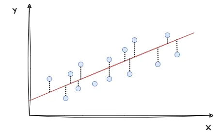

## Covariance et corrélation

- **Covariance** => moyenne des produits des écarts à leur moyenne des deux variables :

$Cov(X,Y) = \frac{1}{n-1} \sum_{i=1}^{n} (x_i - \bar{x})(y_i - \bar{y})$

- **Coefficient de corrélation de Bravais-Pearson** => rapport entre la covariance et la racine carrée des produits des variances des deux variables :

$r = \frac{Cov(X,Y)}{\sqrt{Var(X)Var(Y)}}$ ou

$r = \frac{\sum_{i=1}^{n} (x_i - \bar{x})(y_i - \bar{y})}{\sqrt{\sum_{i=1}^{n} (x_i - \bar{x})^2 \sum_{i=1}^{n} (y_i - \bar{y})^2}}$


